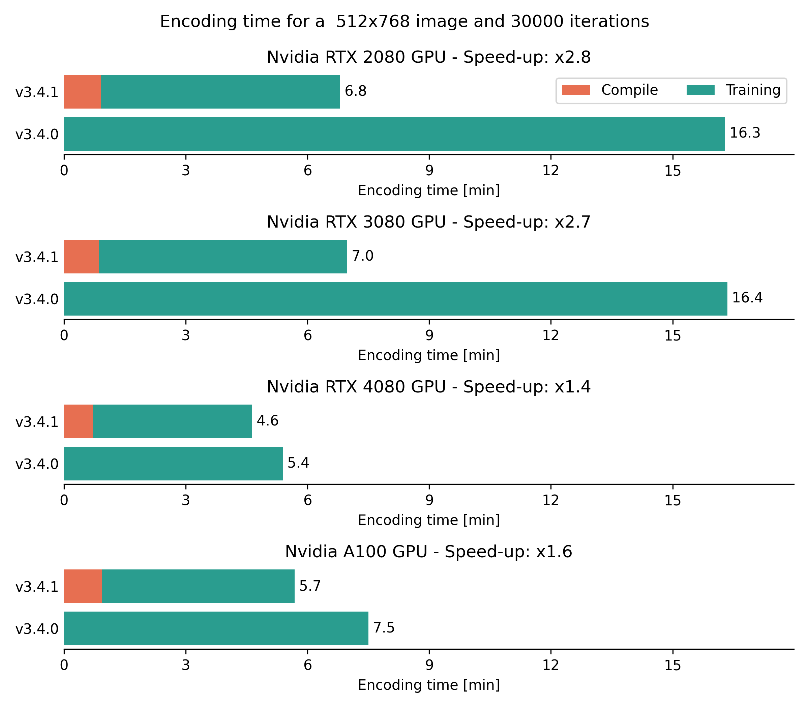
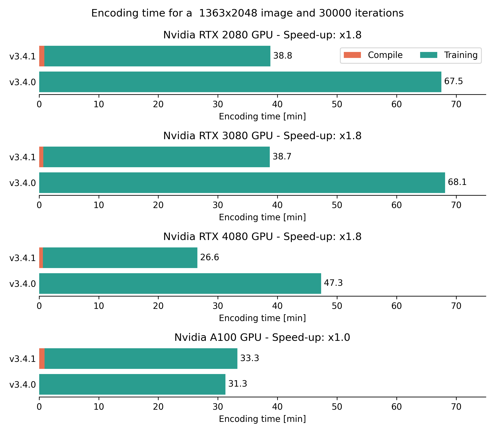
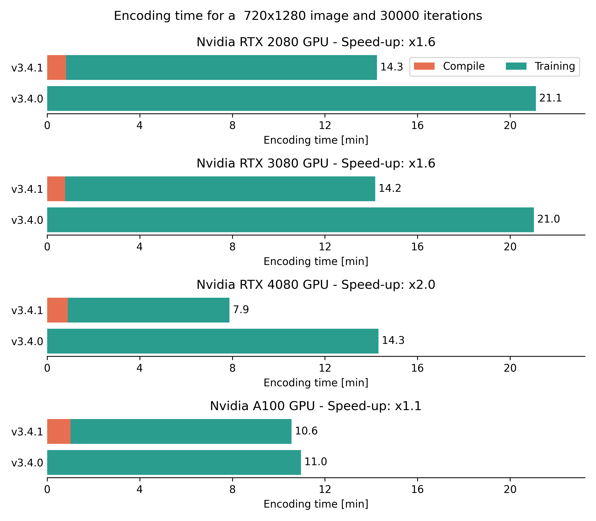

[![Contributors][contributors-shield]][contributors-url]
[![Forks][forks-shield]][forks-url]
[![Stargazers][stars-shield]][stars-url]
[![Issues][issues-shield]][issues-url]
[![BSD-3 License][license-shield]][license-url]
[![PyTorch][pytorch-shield]][pytorch-url]


<!-- PROJECT LOGO -->
<br />
<div align="center">

<picture>
  <!-- User prefers light mode: -->
  <source srcset="docs/source/assets/coolchic-logo-light.png" media="(prefers-color-scheme: light)" alt="Cool-chic Logo" height="200"/>

  <!-- User prefers dark mode: -->
  <source srcset="docs/source/assets/coolchic-logo-dark.png"  media="(prefers-color-scheme: dark)" alt="Cool-chic Logo" height="200"/>

  <!-- User has no color preference: -->
  
</picture>
  <p align="center">
    <!-- Low-complexity neural image codec based on overfitting. -->
    <br />
    <a href="https://orange-opensource.github.io/Cool-Chic/"><strong>Explore the docs »</strong></a>
    <br />
    <br />
    <a href="https://orange-opensource.github.io/Cool-Chic/getting_started/new_stuff.html">What's new in 3.4.1?</a>
    ·
    <a href="https://orange-opensource.github.io/Cool-Chic/results/image/reproduce_results.html">Decode some bitstreams</a>
    ·
    <a href="https://orange-opensource.github.io/Cool-Chic/results/image/compression_performance.html">Coding performance</a>
  </p>
</div>

<!-- # What's Cool-chic? -->

Cool-chic (pronounced <span class="ipa">/kul ʃik/</span> as in French 🥖🧀🍷) is
a low-complexity neural image codec based on overfitting.

* 🏆 **Coding performance**: Cool-chic compresses images as well as H.266/VVC

* 🪶 **Lightweight decoder**: Cool-chic decoder performs only 1000 multiplications per decoded pixel

* 🚀 **Fast CPU-only decoder**: Decode a 1280x720 image in 100 ms on CPU with our decoder written in C

* 🖼️ **I/O format**: Encode PNG, PPM and YUV 420 & 444 files with a bitdepth of 8 to 16 bits

#


<div align="center">

### Happy new year release: 🎉 __Cool-chic 3.4.1: Faster encoder!__ 🎉

</div>

- Speed-up GPU Encoding **up to 3 times**! Check-out the detailed [encoding speed-up measurements](https://orange-opensource.github.io/Cool-Chic/results/image/encoding_complexity.html#encoding-time)
- Change encoder configuration files with better medium and slow [encoding presets](https://orange-opensource.github.io/Cool-Chic/encoding/preset.html#some-existing-configuration-files)

Check-out the [release history](https://github.com/Orange-OpenSource/Cool-Chic/releases) to see previous versions of Cool-chic.

# Setup

More details are available on the [Cool-chic page](https://orange-opensource.github.io/Cool-Chic/getting_started/quickstart.html)

```bash
# We need to get these packages to compile the C API and bind it to python.
sudo add-apt-repository -y ppa:deadsnakes/ppa && sudo apt update
sudo apt install -y build-essential python3.10-dev pip g++-12
git clone https://github.com/Orange-OpenSource/Cool-Chic.git && cd Cool-Chic

# Install create and activate virtual env
python3.10 -m pip install virtualenv
python3.10 -m virtualenv venv && source venv/bin/activate

# Install Cool-chic
CXX=g++-12 pip install -e .

# Sanity check
python -m test.sanity_check
```

You're good to go!


## Compression performance

The Cool-chic page provides [comprehensive rate-distortion results](https://orange-opensource.github.io/Cool-Chic/results/image/compression_performance.html) and compressed bitstreams](https://orange-opensource.github.io/Cool-Chic/results/image/reproduce_results.html) allowing
to reproduce the results inside the ```results/``` directory.

</br>

<table class="tg"><thead>
  <tr>
    <th class="tg-86ol" rowspan="2"></th>
    <th class="tg-86ol" colspan="6">BD-rate of Cool-chic 3.4 vs. [%]</th>
    <th class="tg-86ol" colspan="2">Avg. decoder complexity</th>
  </tr>
  <tr>
    <th class="tg-86ol"><a href="https://arxiv.org/abs/2001.01568" target="_blank" rel="noopener noreferrer">Cheng</a></th>
    <th class="tg-86ol"><a href="https://arxiv.org/abs/2203.10886" target="_blank" rel="noopener noreferrer">ELIC</a></th>
    <th class="tg-dfl2"><span style="font-weight:bold">Cool-chic 3.3</span></th>
    <th class="tg-86ol"><a href="https://arxiv.org/abs/2312.02753" target="_blank" rel="noopener noreferrer">C3</a></th>
    <th class="tg-86ol">HEVC (HM 16)</th>
    <th class="tg-86ol">VVC (VTM 19)</th>
    <th class="tg-86ol">MAC / pixel</th>
    <th class="tg-86ol">CPU Time [ms]</th>
  </tr></thead>
<tbody>
  <tr>
    <td class="tg-86ol">kodak</td>
    <td class="tg-qch7">-4.2 %</td>
    <td class="tg-xd3r">+7.5 %</td>
    <td class="tg-qch7">-0.9 %</td>
    <td class="tg-qch7">-4.3 %</td>
    <td class="tg-qch7">-17.2 %</td>
    <td class="tg-xd3r">+3.4 % </td>
    <td class="tg-dfl2">1303</td>
    <td class="tg-dfl2">74</td>
  </tr>
  <tr>
    <td class="tg-86ol">clic20-pro-valid</td>
    <td class="tg-qch7">-13.2 %</td>
    <td class="tg-qch7">-0.2 %</td>
    <td class="tg-qch7">-0.3 %</td>
    <td class="tg-qch7">-1.3 %</td>
    <td class="tg-qch7">-25.1 %</td>
    <td class="tg-qch7">-2.3 %<br></td>
    <td class="tg-dfl2">1357</td>
    <td class="tg-dfl2">354</td>
  </tr>
  <tr>
    <td class="tg-86ol">jvet (BCDEF)</td>
    <td class="tg-5niz">/</td>
    <td class="tg-5niz">/</td>
    <td class="tg-qch7">-0.2 %</td>
    <td class="tg-5niz">/</td>
    <td class="tg-qch7">-18.3 %</td>
    <td class="tg-xd3r">+18.6 %</td>
    <td class="tg-dfl2">1249</td>
    <td class="tg-dfl2">143</td>
  </tr>
  <tr>
    <td class="tg-x9uu">jvet (class B)</td>
    <td class="tg-1keu">/</td>
    <td class="tg-1keu">/</td>
    <td class="tg-arzi">+0.9%</td>
    <td class="tg-1keu">/</td>
    <td class="tg-uflc">-9.9 %</td>
    <td class="tg-arzi">+20.7 %</td>
    <td class="tg-m5nv">1300</td>
    <td class="tg-m5nv">282</td>
  </tr>
  <tr>
    <td class="tg-x9uu">jvet (class C)</td>
    <td class="tg-1keu">/</td>
    <td class="tg-1keu">/</td>
    <td class="tg-uflc">-1.3%</td>
    <td class="tg-1keu">/</td>
    <td class="tg-uflc">-16.1 %</td>
    <td class="tg-arzi">+9.2 %</td>
    <td class="tg-m5nv">1289</td>
    <td class="tg-m5nv">69</td>
  </tr>
  <tr>
    <td class="tg-x9uu">jvet (class D)</td>
    <td class="tg-1keu">/</td>
    <td class="tg-1keu">/</td>
    <td class="tg-uflc">-1.4%</td>
    <td class="tg-1keu">/</td>
    <td class="tg-uflc">-12.4 %</td>
    <td class="tg-arzi">+9.6 %</td>
    <td class="tg-m5nv">948</td>
    <td class="tg-m5nv">18</td>
  </tr>
  <tr>
    <td class="tg-x9uu">jvet (class E)</td>
    <td class="tg-1keu">/</td>
    <td class="tg-1keu">/</td>
    <td class="tg-uflc">-3.8%</td>
    <td class="tg-1keu">/</td>
    <td class="tg-uflc">-6.2 %</td>
    <td class="tg-arzi">+27.8 %</td>
    <td class="tg-m5nv">1347</td>
    <td class="tg-m5nv">125</td>
  </tr>
  <tr>
    <td class="tg-x9uu">jvet (class F)</td>
    <td class="tg-1keu">/</td>
    <td class="tg-1keu">/</td>
    <td class="tg-arzi">+0.2%</td>
    <td class="tg-1keu">/</td>
    <td class="tg-uflc">-31.8 %</td>
    <td class="tg-arzi">+20.6 %</td>
    <td class="tg-m5nv">1249</td>
    <td class="tg-m5nv">182</td>
  </tr>
</tbody></table>

<br/>

## Compression performance and decoding time

_Decoding time are obtained on a single CPU core of an an AMD EPYC 7282 16-Core Processor_

_PSNR is computed in the RGB domain for kodak and CLIC20, in the YUV420 domain for jvet_


### Kodak

<div style="text-align: center;">
    
</div>
<br/>

### CLIC20 Pro Valid

<div style="text-align: center;">
    
</div>
<br/>

### JVET Class B

<div style="text-align: center;">
    
</div>
<br/>

</br>

## Encoding time

The graphs below present the time required to encode several images resolutions
on different hardwares. These figures are obtained using the
``cfg/enc/medium_30k.cfg`` encoding configuration.

### Kodak image 512x768

<div style="text-align: center;">
    
</div>
<br/>

### CLIC20 Pro Valid image 1363x2048

<div style="text-align: center;">
    
</div>
<br/>

### JVET Class E image 720x1280

<div style="text-align: center;">
    
</div>
<br/>

</br>


# Thanks

Special thanks go to Hyunjik Kim, Matthias Bauer, Lucas Theis, Jonathan Richard Schwarz and Emilien Dupont for their great work enhancing Cool-chic: [_C3: High-performance and low-complexity neural compression from a single image or video_, Kim et al.](https://arxiv.org/abs/2312.02753)

<!-- MARKDOWN LINKS & IMAGES -->
<!-- https://www.markdownguide.org/basic-syntax/#reference-style-links -->
[contributors-shield]: https://img.shields.io/github/contributors/Orange-OpenSource/Cool-Chic.svg?style=for-the-badge
[contributors-url]: https://github.com/Orange-OpenSource/Cool-Chic/graphs/contributors
[forks-shield]: https://img.shields.io/github/forks/Orange-OpenSource/Cool-Chic.svg?style=for-the-badge
[forks-url]: https://github.com/Orange-OpenSource/Cool-Chic/network/members
[stars-shield]: https://img.shields.io/github/stars/Orange-OpenSource/Cool-Chic.svg?style=for-the-badge
[stars-url]: https://github.com/Orange-OpenSource/Cool-Chic/stargazers
[issues-shield]: https://img.shields.io/github/issues/Orange-OpenSource/Cool-Chic.svg?style=for-the-badge
[issues-url]: https://github.com/Orange-OpenSource/Cool-Chic/issues
[license-shield]: https://img.shields.io/github/license/Orange-OpenSource/Cool-Chic.svg?style=for-the-badge
[license-url]: https://github.com/Orange-OpenSource/Cool-Chic/blob/master/LICENSE.txt
[pytorch-shield]: https://img.shields.io/badge/PyTorch-0769AD?style=for-the-badge&logo=pytorch&logoColor=white
[pytorch-url]: https://pytorch.org/

<div align="center">


#

</br>

<picture>
  <!-- User has no color preference: -->
  
</picture>
</div>
