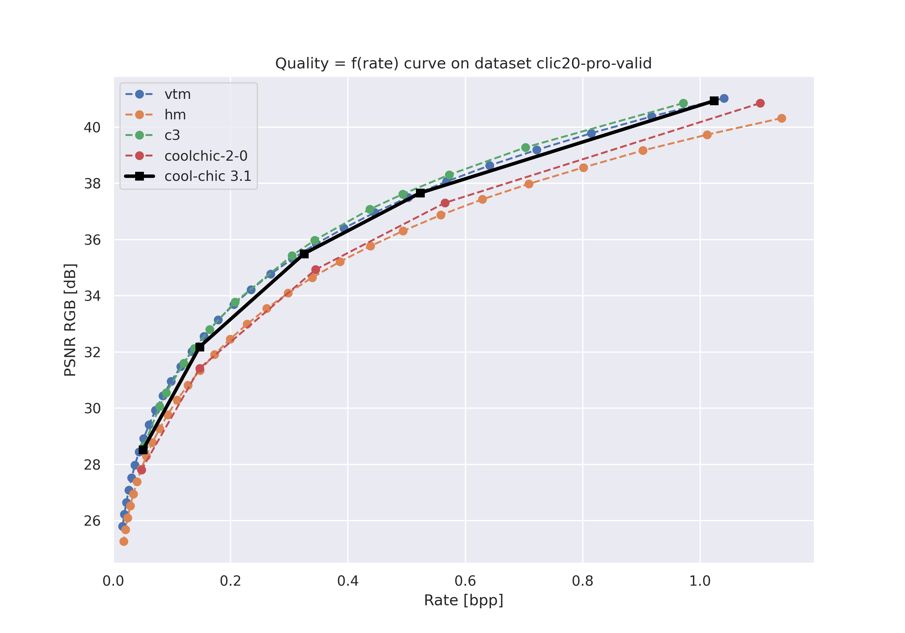
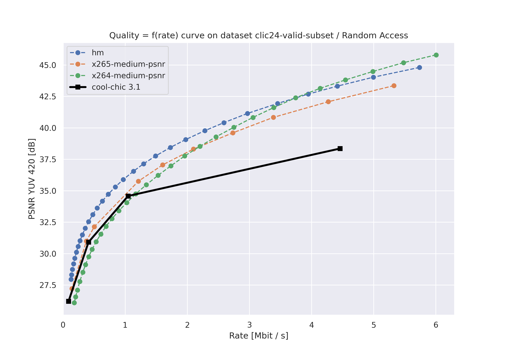

# 🎬 __Cool-chic 3.1: Now it does video!__


# COOL-CHIC

Cool-chic (pronounced <span class="ipa">/kul ʃik/</span> as in French 🥖🧀🍷) is
 is a low-complexity neural image and video codec based on overfitting. Image
 coding performance are on par with VVC for 2000 multiplication per decoded
 pixels, while video coding performance compete with AVC with as few as 500
 multiplication per decoded pixels.

All the documentation is available on the [Cool-chic page](https://orange-opensource.github.io/Cool-Chic/)

# Version history

* Fev. 24: version 3.1
    - Cool-chic video from [_Cool-chic video: Learned video coding with 800 parameters_, Leguay et al.](https://arxiv.org/abs/2402.03179)
    - Random access and low-delay video coding, competitive with AVC.
* Jan. 24: version 3.0
    - Re-implement most of the encoder-side improvements proposed by [_C3: High-performance and low-complexity neural compression from a single image or video_, Kim et al.](https://arxiv.org/abs/2312.02753)
    - 15% to 20% rate decrease compared to Cool-chic 2
* July 23: version 2 [_Low-complexity Overfitted Neural Image Codec_, Leguay et al.](https://arxiv.org/abs/2307.12706)
    - Several architecture changes for the decoder: convolution-based synthesis, learnable upsampling module
    - Friendlier usage: support for YUV 420 input format in 8-bit and 10-bit & Fixed point arithmetic for cross-platform entropy (de)coding
* March 23: version 1 [_COOL-CHIC: Coordinate-based Low Complexity Hierarchical Image Codec_, Ladune et al.](https://arxiv.org/abs/2212.05458)

Up to come: a fast decoder implementation will be released soon for near real-time CPU decoding 🏎️ 🔥.

# Cool-chic 3.1 performance

Cool-chic results are provided for both image and video compression inside the
```results/``` directory alongside compressed bitstream.

## Image compression

Image compression performance are presented on the kodak and clic20-pro-valid dataset.

<div style="text-align: center;">
    
    
</div>

<br/>

| Dataset          | Vs. Cool-chic 2                              | Vs. Cool-chic 1                              | Vs. [_C3_, Kim et al.](https://arxiv.org/abs/2312.02753) | Vs. HEVC (HM 16.20)                          | Vs. VVC (VTM 19.1)                           | Minimum decoder complexity [MAC / pixel]     | Maximum decoder complexity [MAC / pixel]     | Average decoder complexity [MAC / pixel]     |
|------------------|----------------------------------------------|----------------------------------------------|----------------------------------------------------------|----------------------------------------------|----------------------------------------------|----------------------------------------------|----------------------------------------------|----------------------------------------------|
| kodak            | <span style="color:green" > - 18.3 % </span> | <span style="color:green"> - 28.1 % </span>  | <span style="color:green"> - 0.2 %  </span>              | <span style="color:green" > - 13.4 % </span> | <span style="color:#f50" > + 8.1 %   </span> |299                                           |2291                                          | 1281                                         |
| clic20-pro-valid | <span style="color:green" > - 15.8 % </span> | <span style="color:gray"> /  </span>         | <span style="color:#f50" >+  4.6 %   </span>             | <span style="color:green" > - 20.5 % </span> | <span style="color:#f50" > + 3.5 %   </span> |545                                           |2288                                          | 1590                                         |


✨ YUV 420 image coding results coming soon


## Video compression

Video compression performance are presented on the first 33 frames (~= 1 second)
from the [CLIC24 validation
subset](https://storage.googleapis.com/clic2023_public/validation_sets/clic2024_validation_video_30.zip),
composed of 30 high resolution videos. We provide results for 2 coding
configurations:

* Low-delay P: address use-cases where low latency is mandatory;
* Random access: address use-cases where compression efficiency is primordial e.g. video streaming.

<div style="text-align: center;">
    
</div>

<br/>

| Dataset             | Config        | Vs. HEVC (HM 16.20)                          | Vs. x265 medium                              | Vs. x264 medium                              | Minimum decoder complexity [MAC / pixel]     | Maximum decoder complexity [MAC / pixel]     | Average decoder complexity [MAC / pixel]     |
|---------------------|---------------|----------------------------------------------|----------------------------------------------|----------------------------------------------|----------------------------------------------|----------------------------------------------|----------------------------------------------|
| clic24-valid-subset | random-access | <span style="color:#f50" > + 65.6 % </span>  | <span style="color:#f50" > + 21.5 %   </span> | <span style="color:green" >- 12.4 % </span> |460                                           |460                                           | 460                                          |

✨ Low-delay P coding results coming soon!

# Setup

More details available on the [Cool-chic page](https://orange-opensource.github.io/Cool-Chic/)

## ⚠️ Python version

Python version should be at least 3.10!

```bash
python3 --version                                          # Should be at least 3.10
```

## Necessary packages

```bash
python3 -m pip install virtualenv                          # Install virtual env if needed
python3 -m virtualenv venv && source venv/bin/activate     # Create and activate a virtual env named "venv"
(venv) pip install -r requirements.txt                     # Install the required packages
```

# Replicating Cool-chic results

Already encoded files are provided as bitstreams in ```results/<configuration>/<dataset_name>/```.

* ```<configuration>``` can be ```image```, ```video-low-latency```, ```video-random-access```
* ```<dataset_name>``` can be ```kodak, clic20-pro-valid, clic24-valid-subset, jvet```.

For each dataset, a script is provided to decode all the bitstreams.

```bash
(venv) python results/decode_one_dataset.py <configuration> <dataset_name>  # Can take a few minutes
```

The file ```results/<configuration>/<dataset_name>/results.tsv``` provides the results that should be obtained.

<br/>

# Thanks

Special thanks go to:

* Robert Bamler for the [_constriction package_](https://github.com/bamler-lab/constriction) which serves as our entropy coder. More details @ [_Understanding Entropy Coding With Asymmetric Numeral Systems (ANS): a Statistician's Perspective_, Bamler](https://arxiv.org/pdf/2201.01741.pdf).
* Hyunjik Kim, Matthias Bauer, Lucas Theis, Jonathan Richard Schwarz and Emilien Dupont for their great work enhancing Cool-chic: [_C3: High-performance and low-complexity neural compression from a single image or video_, Kim et al.](https://arxiv.org/abs/2312.02753)
e