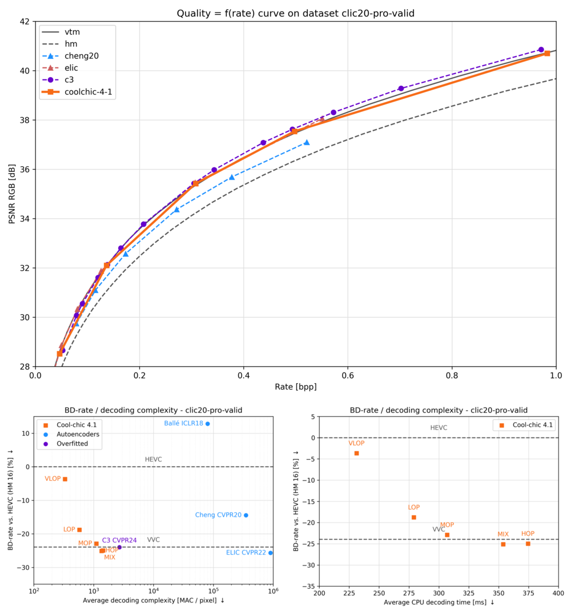
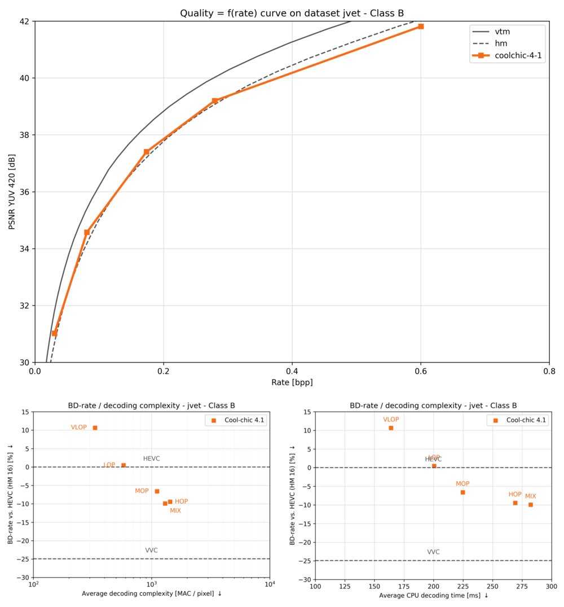

[![Contributors][contributors-shield]][contributors-url]
[![Forks][forks-shield]][forks-url]
[![Stargazers][stars-shield]][stars-url]
[![Issues][issues-shield]][issues-url]
[![BSD-3 License][license-shield]][license-url]
[![PyTorch][pytorch-shield]][pytorch-url]


<!-- PROJECT LOGO -->
<br />
<div align="center">

<picture>
  <!-- User prefers light mode: -->
  <source srcset="docs/source/assets/coolchic-logo-light.png" media="(prefers-color-scheme: light)" alt="Cool-chic Logo" height="200"/>

  <!-- User prefers dark mode: -->
  <source srcset="docs/source/assets/coolchic-logo-dark.png"  media="(prefers-color-scheme: dark)" alt="Cool-chic Logo" height="200"/>

  <!-- User has no color preference: -->
  
</picture>
  <p align="center">
    <!-- Low-complexity neural image codec based on overfitting. -->
    <br />
    <a href="https://orange-opensource.github.io/Cool-Chic/"><strong>Explore the docs »</strong></a>
    <br />
    <br />
    <a href="https://orange-opensource.github.io/Cool-Chic/getting_started/new_stuff.html">What's new in 3.4?</a>
    ·
    <a href="https://orange-opensource.github.io/Cool-Chic/getting_started/results.html">Decode some bitstreams</a>
    ·
    <a href="https://orange-opensource.github.io/Cool-Chic/getting_started/results.html#clic20-pro-valid">Coding performance</a>
  </p>
</div>

<!-- # What's Cool-chic? -->

Cool-chic (pronounced <span class="ipa">/kul ʃik/</span> as in French 🥖🧀🍷) is
a low-complexity neural image codec based on overfitting. It offers image coding
performance competitive with **H.266/VVC for 1000 multiplications** per decoded
pixel.


<div align="center">

#### 🏆 **Coding performance**: Cool-chic compresses images as well as H.266/VVC 🏆
#### 🚀 **Fast CPU-only decoder**: Decode a 1280x720 image in 100 ms on CPU with our decoder written in C 🚀
#### 🔥 **Fixed-point decoder**: Fixed-point arithmetic at the decoder for bit-exact results on different hardwares 🔥
#### 🖼️ **I/O format**: Encode PNG, PPM and YUV 420 & 444 files with a bitdepth of 8 to 16 bits 🖼️

</div>

#


<div align="center">

### Latest release: 🎉 __Cool-chic 3.4: 30% less complex!__ 🎉

</div>

- New and improved latent **upsampling module**
    - Leverage symmetric and separable convolution kernels to reduce complexity & parameters count
    - Learn two filters per upsampling step instead of one for all upsampling steps
- 1% to 5% **rate reduction** for the same image quality
- **30% complexity reduction** using a smaller Auto-Regressive Module
    - From 2000 MAC / decoded pixel to 1300 MAC / decoded pixel
    - **10% faster** decoding speed

Check-out the [release history](https://github.com/Orange-OpenSource/Cool-Chic/releases) to see previous versions of Cool-chic.

# Setup

More details are available on the [Cool-chic page](https://orange-opensource.github.io/Cool-Chic/getting_started/quickstart.html)

```bash
# We need to get these packages to compile the C API and bind it to python.
sudo add-apt-repository -y ppa:deadsnakes/ppa && sudo apt update
sudo apt install -y build-essential python3.10-dev pip
git clone https://github.com/Orange-OpenSource/Cool-Chic.git && cd Cool-Chic

# Install create and activate virtual env
python3.10 -m pip install virtualenv
python3.10 -m virtualenv venv && source venv/bin/activate

# Install Cool-chic
pip install -e .

# Sanity check
python -m test.sanity_check
```

You're good to go!


## Performance

The Cool-chic page provides [comprehensive rate-distortion results and compressed bitstreams](https://orange-opensource.github.io/Cool-Chic/getting_started/results.html) allowing
to reproduce the results inside the ```results/``` directory.

<table class="tg"><thead>
  <tr>
    <th class="tg-86ol" rowspan="2"></th>
    <th class="tg-86ol" colspan="6">BD-rate of Cool-chic 3.4 vs. [%]</th>
    <th class="tg-86ol" colspan="2">Avg. decoder complexity</th>
  </tr>
  <tr>
    <th class="tg-86ol"><a href="https://arxiv.org/abs/2001.01568" target="_blank" rel="noopener noreferrer">Cheng</a></th>
    <th class="tg-86ol"><a href="https://arxiv.org/abs/2203.10886" target="_blank" rel="noopener noreferrer">ELIC</a></th>
    <th class="tg-dfl2"><span style="font-weight:bold">Cool-chic 3.3</span></th>
    <th class="tg-86ol"><a href="https://arxiv.org/abs/2312.02753" target="_blank" rel="noopener noreferrer">C3</a></th>
    <th class="tg-86ol">HEVC (HM 16)</th>
    <th class="tg-86ol">VVC (VTM 19)</th>
    <th class="tg-86ol">MAC / pixel</th>
    <th class="tg-86ol">CPU Time [ms]</th>
  </tr></thead>
<tbody>
  <tr>
    <td class="tg-86ol">kodak</td>
    <td class="tg-qch7"><span style="color:green" > -4.2 % </span></td>
    <td class="tg-xd3r"><span style="color:red"   > +7.5 % </span></td>
    <td class="tg-qch7"><span style="color:green" > -0.9 % </span></td>
    <td class="tg-qch7"><span style="color:green" > -4.3 % </span></td>
    <td class="tg-qch7"><span style="color:green" > -17.2 % </span></td>
    <td class="tg-xd3r"><span style="color:red"   > +3.4 %  </span></td>
    <td class="tg-dfl2">1303</td>
    <td class="tg-dfl2">74</td>
  </tr>
  <tr>
    <td class="tg-86ol">clic20-pro-valid</td>
    <td class="tg-qch7"><span style="color:green" > -13.2 % </span></td>
    <td class="tg-qch7"><span style="color:green" > -0.2 % </span></td>
    <td class="tg-qch7"><span style="color:green" > -0.3 % </span></td>
    <td class="tg-qch7"><span style="color:green" > -1.3 % </span></td>
    <td class="tg-qch7"><span style="color:green" > -25.1 % </span></td>
    <td class="tg-qch7"><span style="color:green" > -2.3 %<br> </span></td>
    <td class="tg-dfl2">1357</td>
    <td class="tg-dfl2">354</td>
  </tr>
  <tr>
    <td class="tg-86ol">jvet </td>
    <td class="tg-5niz"><span style="color:gray" >/</span></td>
    <td class="tg-5niz"><span style="color:gray" >/</span></td>
    <td class="tg-qch7"><span style="color:green" >-0.2 %</span></td>
    <td class="tg-5niz"><span style="color:gray" >/</span></td>
    <td class="tg-qch7"><span style="color:green" >-18.3 %</span></td>
    <td class="tg-xd3r"><span style="color:red" >+18.6 %</span></td>
    <td class="tg-dfl2">1249</td>
    <td class="tg-dfl2">143</td>
  </tr>
</tbody></table>

<br/>

_Decoding time are obtained on a single CPU core of an an AMD EPYC 7282 16-Core Processor_

_PSNR is computed in the RGB domain for kodak and CLIC20, in the YUV420 domain for jvet_


### Kodak

<div style="text-align: center;">
    
</div>
<br/>

### CLIC20 Pro Valid

<div style="text-align: center;">
    
</div>
<br/>

### JVET Class B

<div style="text-align: center;">
    
</div>
<br/>

</br>

# Thanks

Special thanks go to Hyunjik Kim, Matthias Bauer, Lucas Theis, Jonathan Richard Schwarz and Emilien Dupont for their great work enhancing Cool-chic: [_C3: High-performance and low-complexity neural compression from a single image or video_, Kim et al.](https://arxiv.org/abs/2312.02753)

<!-- MARKDOWN LINKS & IMAGES -->
<!-- https://www.markdownguide.org/basic-syntax/#reference-style-links -->
[contributors-shield]: https://img.shields.io/github/contributors/Orange-OpenSource/Cool-Chic.svg?style=for-the-badge
[contributors-url]: https://github.com/Orange-OpenSource/Cool-Chic/graphs/contributors
[forks-shield]: https://img.shields.io/github/forks/Orange-OpenSource/Cool-Chic.svg?style=for-the-badge
[forks-url]: https://github.com/Orange-OpenSource/Cool-Chic/network/members
[stars-shield]: https://img.shields.io/github/stars/Orange-OpenSource/Cool-Chic.svg?style=for-the-badge
[stars-url]: https://github.com/Orange-OpenSource/Cool-Chic/stargazers
[issues-shield]: https://img.shields.io/github/issues/Orange-OpenSource/Cool-Chic.svg?style=for-the-badge
[issues-url]: https://github.com/Orange-OpenSource/Cool-Chic/issues
[license-shield]: https://img.shields.io/github/license/Orange-OpenSource/Cool-Chic.svg?style=for-the-badge
[license-url]: https://github.com/Orange-OpenSource/Cool-Chic/blob/master/LICENSE.txt
[pytorch-shield]: https://img.shields.io/badge/PyTorch-0769AD?style=for-the-badge&logo=pytorch&logoColor=white
[pytorch-url]: https://pytorch.org/

<div align="center">


#

</br>

<picture>
  <!-- User has no color preference: -->
  
</picture>
</div>
