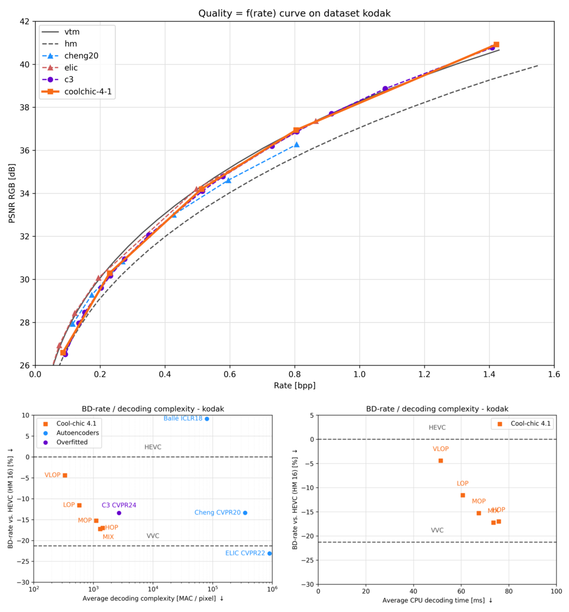

[![Forks][forks-shield]][forks-url]
[![Stargazers][stars-shield]][stars-url]
[![Issues][issues-shield]][issues-url]
[![BSD-3 License][license-shield]][license-url]
[![PyTorch][pytorch-shield]][pytorch-url]


<!-- PROJECT LOGO -->
<br />
<div align="center">

<picture>
  <!-- User prefers light mode: -->
  <source srcset="docs/source/assets/coolchic-logo-light.png" media="(prefers-color-scheme: light)" alt="Cool-chic Logo" height="200"/>

  <!-- User prefers dark mode: -->
  <source srcset="docs/source/assets/coolchic-logo-dark.png"  media="(prefers-color-scheme: dark)" alt="Cool-chic Logo" height="200"/>

  <!-- User has no color preference: -->
  
</picture>
  <p align="center">
    <!-- Low-complexity neural image codec based on overfitting. -->
    <br />
    <a href="https://orange-opensource.github.io/Cool-Chic/"><strong>Explore the docs </strong></a>
    <!-- <br />
    <br /> -->
    .
    <a href="https://orange-opensource.github.io/Cool-Chic/getting_started/new_stuff.html">What's new in 4.1.0?</a>
    ·
    <a href="https://orange-opensource.github.io/Cool-Chic/results/image/compression_performance.html">Image coding performance</a>
    .
    <a href="https://orange-opensource.github.io/Cool-Chic/results/video/compression_performance.html">Video coding performance</a>
  </p>
</div>

<!-- # What's Cool-chic? -->

Cool-chic (pronounced <span class="ipa">/kul ʃik/</span> as in French 🥖🧀🍷) is
a low-complexity neural image codec based on overfitting.

* 🏆 **Coding performance**: Cool-chic compresses images as well as H.266/VVC

* 🪶 **Lightweight decoder**: Cool-chic decoder performs only 1000 multiplications per decoded pixel

* 🚀 **Fast CPU-only decoder**: Decode a 1280x720 image in 100 ms on CPU with our decoder written in C

* 🖼️ **I/O format**: Encode PNG, PPM and YUV 420 & 444 files with a bitdepth of 8 to 16 bits


<div align="center">

### 🔮 __Cool-chic 4.1.0: Revisiting temporal prediction!__ 🔮

</div>

Cool-chic 4.1 focuses on video coding, improving particularly the temporal
prediction through better and lighter sub-pixel motion compensation. This
release is linked to the following paper: [_Efficient Sub-pixel Motion Compensation in Learned Video Codecs_, Ladune et al.](https://arxiv.org/pdf/2507.21926).

- Replace 2-tap bilinear filtering with sinc-based 8-tap filters
- Decode motion fields at 1/4 of the frame resolution for lighter decoding complexity
- Improved video compression performance: **-23.6% rate** versus Cool-chic 4.0
- Decrease motion-related complexity by 30%, **from 391 to 214 MAC / decoded pixel** 

Check-out the [release history](https://github.com/Orange-OpenSource/Cool-Chic/releases) to see previous versions of Cool-chic.

# Setup

More details are available on the [Cool-chic page](https://orange-opensource.github.io/Cool-Chic/getting_started/quickstart.html)

```bash
# We need to get these packages to compile the C API and bind it to python.
sudo add-apt-repository -y ppa:deadsnakes/ppa && sudo apt update
sudo apt install -y build-essential python3.10-dev pip g++
git clone https://github.com/Orange-OpenSource/Cool-Chic.git && cd Cool-Chic

# Install create and activate virtual env
python3.10 -m pip install virtualenv
python3.10 -m virtualenv venv && source venv/bin/activate

# Install Cool-chic
pip install -e .

# Sanity check
python -m test.sanity_check
```

You're good to go!


## Image compression performance

<table class="tg"><thead>
  <tr>
    <th class="tg-86ol" rowspan="2"></th>
    <th class="tg-86ol" colspan="5">BD-rate of Cool-chic 4.1 vs. [%]</th>
    <th class="tg-86ol" colspan="2">Avg. decoder complexity</th>
  </tr>
  <tr>
    <th class="tg-86ol"><a href="https://arxiv.org/abs/2001.01568" target="_blank" rel="noopener noreferrer">Cheng</a></th>
    <th class="tg-86ol"><a href="https://arxiv.org/abs/2203.10886" target="_blank" rel="noopener noreferrer">ELIC</a></th>
    <th class="tg-86ol"><a href="https://arxiv.org/abs/2312.02753" target="_blank" rel="noopener noreferrer">C3</a></th>
    <th class="tg-86ol">HEVC (HM 16)</th>
    <th class="tg-86ol">VVC (VTM 19)</th>
    <th class="tg-86ol">MAC / pixel</th>
    <th class="tg-86ol">CPU Time [ms]</th>
  </tr></thead>
<tbody>
  <tr>
    <td class="tg-86ol">kodak</td>
    <td class="tg-qch7">-4.2 %</td>
    <td class="tg-xd3r">+7.5 %</td>
    <td class="tg-qch7">-4.3 %</td>
    <td class="tg-qch7">-17.2 %</td>
    <td class="tg-xd3r">+3.4 % </td>
    <td class="tg-dfl2">1303</td>
    <td class="tg-dfl2">74</td>
  </tr>
  <tr>
    <td class="tg-86ol">clic20-pro-valid</td>
    <td class="tg-qch7">-13.2 %</td>
    <td class="tg-qch7">-0.2 %</td>
    <td class="tg-qch7">-1.3 %</td>
    <td class="tg-qch7">-25.1 %</td>
    <td class="tg-qch7">-2.3 %<br></td>
    <td class="tg-dfl2">1357</td>
    <td class="tg-dfl2">354</td>
  </tr>
  <tr>
    <td class="tg-86ol">jvet (BCDEF)</td>
    <td class="tg-5niz">/</td>
    <td class="tg-5niz">/</td>
    <td class="tg-5niz">/</td>
    <td class="tg-qch7">-18.3 %</td>
    <td class="tg-xd3r">+18.6 %</td>
    <td class="tg-dfl2">1249</td>
    <td class="tg-dfl2">143</td>
  </tr>
  <tr>
    <td class="tg-x9uu">jvet (class B)</td>
    <td class="tg-1keu">/</td>
    <td class="tg-1keu">/</td>
    <td class="tg-1keu">/</td>
    <td class="tg-uflc">-9.9 %</td>
    <td class="tg-arzi">+20.7 %</td>
    <td class="tg-m5nv">1300</td>
    <td class="tg-m5nv">282</td>
  </tr>
  <tr>
    <td class="tg-x9uu">jvet (class C)</td>
    <td class="tg-1keu">/</td>
    <td class="tg-1keu">/</td>
    <td class="tg-1keu">/</td>
    <td class="tg-uflc">-16.1 %</td>
    <td class="tg-arzi">+9.2 %</td>
    <td class="tg-m5nv">1289</td>
    <td class="tg-m5nv">69</td>
  </tr>
  <tr>
    <td class="tg-x9uu">jvet (class D)</td>
    <td class="tg-1keu">/</td>
    <td class="tg-1keu">/</td>
    <td class="tg-1keu">/</td>
    <td class="tg-uflc">-12.4 %</td>
    <td class="tg-arzi">+9.6 %</td>
    <td class="tg-m5nv">948</td>
    <td class="tg-m5nv">18</td>
  </tr>
  <tr>
    <td class="tg-x9uu">jvet (class E)</td>
    <td class="tg-1keu">/</td>
    <td class="tg-1keu">/</td>
    <td class="tg-1keu">/</td>
    <td class="tg-uflc">-6.2 %</td>
    <td class="tg-arzi">+27.8 %</td>
    <td class="tg-m5nv">1347</td>
    <td class="tg-m5nv">125</td>
  </tr>
  <tr>
    <td class="tg-x9uu">jvet (class F)</td>
    <td class="tg-1keu">/</td>
    <td class="tg-1keu">/</td>
    <td class="tg-1keu">/</td>
    <td class="tg-uflc">-31.8 %</td>
    <td class="tg-arzi">+20.6 %</td>
    <td class="tg-m5nv">1249</td>
    <td class="tg-m5nv">182</td>
  </tr>
</tbody></table>

<br/>

## Compression performance and decoding time

The Cool-chic page provides [comprehensive video rate-distortion results](https://orange-opensource.github.io/Cool-Chic/results/video/compression_performance.html).


<!-- _Decoding time are obtained on a single CPU core of an an AMD EPYC 7282 16-Core Processor_

_PSNR is computed in the RGB domain for kodak and CLIC20, in the YUV420 domain for jvet_ -->


<!-- ### Kodak

<div style="text-align: center;">
    
</div>
<br/> -->

### CLIC20 Pro Valid

<div style="text-align: center;">
    
</div>
<br/>

<!-- ### JVET Class B

<div style="text-align: center;">
    
</div>
<br/> -->

</br>


## Video compression performance

The Cool-chic page provides [comprehensive video rate-distortion results](https://orange-opensource.github.io/Cool-Chic/results/video/compression_performance.html).

### Random access results (intra period 32)

  <table class="tg"><thead>
  <tr>
      <th class="tg-86ol" rowspan="2">Sequence</th>
      <th class="tg-86ol" colspan="4">BD-rate of Cool-chic 4.1.0 against [%]</th>
      <th class="tg-86ol" colspan="2">Decoding complexity</th>
  </tr>
  <tr>
      <th class="tg-86ol">HEVC (HM 16)</th>
      <th class="tg-86ol">HEVC (x265-medium)</th>
      <th class="tg-86ol">AVC (x264-medium)</th>
      <th class="tg-86ol">Cool-chic 4.0</th>
      <th class="tg-86ol">MAC / pixel</th>
      <th class="tg-86ol">Frame rate [fps]</th>
  </tr></thead>
  <tbody>
  <tr>
      <td class="tg-9mze">C-BasketballDrill</td>
      <td class="tg-xd3r">+30.8</td>
      <td class="tg-qch7">-5.2</td>
      <td class="tg-qch7">-29.5</td>
      <td class="tg-qch7">-17.5</td>
      <td class="tg-dfl2">639</td>
      <td class="tg-dfl2">11.2</td>
  </tr>
  <tr>
      <td class="tg-9mze">C-BQMall</td>
      <td class="tg-xd3r">+77.1</td>
      <td class="tg-xd3r">+16.6</td>
      <td class="tg-qch7">-6.0</td>
      <td class="tg-qch7">-21.1</td>
      <td class="tg-dfl2">639</td>
      <td class="tg-dfl2">11.3</td>
  </tr>
  <tr>
      <td class="tg-9mze">C-PartyScene</td>
      <td class="tg-xd3r">+28.3</td>
      <td class="tg-qch7">-15.1</td>
      <td class="tg-qch7">-39.2</td>
      <td class="tg-qch7">-39.1</td>
      <td class="tg-dfl2">639</td>
      <td class="tg-dfl2">10.8</td>
  </tr>
  <tr>
      <td class="tg-9mze">C-RaceHorses</td>
      <td class="tg-xd3r">+79.6</td>
      <td class="tg-xd3r">+17.4</td>
      <td class="tg-xd3r">+8.6</td>
      <td class="tg-qch7">-16.8</td>
      <td class="tg-dfl2">639</td>
      <td class="tg-dfl2">9.9</td>
  </tr>
  <tr>
      <td class="tg-u3ui">Average</td>
      <td class="tg-aaaa">+54.0</td>
      <td class="tg-aaaa">+3.4</td>
      <td class="tg-qch7">-14.0</td>
      <td class="tg-qch7">-23.6</td>
      <td class="tg-u3ui">639</td>
      <td class="tg-u3ui">10.8</td>
  </tr>
  </tbody></table>

### C-PartyScene

<div style="text-align: center;">
    
</div>
<br/>


# Thanks

Special thanks go to Hyunjik Kim, Matthias Bauer, Lucas Theis, Jonathan Richard Schwarz and Emilien Dupont for their great work enhancing Cool-chic: [_C3: High-performance and low-complexity neural compression from a single image or video_, Kim et al.](https://arxiv.org/abs/2312.02753)

<!-- MARKDOWN LINKS & IMAGES -->
<!-- https://www.markdownguide.org/basic-syntax/#reference-style-links -->
[contributors-shield]: https://img.shields.io/github/contributors/Orange-OpenSource/Cool-Chic.svg?style=for-the-badge
[contributors-url]: https://github.com/Orange-OpenSource/Cool-Chic/graphs/contributors
[forks-shield]: https://img.shields.io/github/forks/Orange-OpenSource/Cool-Chic.svg?style=for-the-badge
[forks-url]: https://github.com/Orange-OpenSource/Cool-Chic/network/members
[stars-shield]: https://img.shields.io/github/stars/Orange-OpenSource/Cool-Chic.svg?style=for-the-badge
[stars-url]: https://github.com/Orange-OpenSource/Cool-Chic/stargazers
[issues-shield]: https://img.shields.io/github/issues/Orange-OpenSource/Cool-Chic.svg?style=for-the-badge
[issues-url]: https://github.com/Orange-OpenSource/Cool-Chic/issues
[license-shield]: https://img.shields.io/github/license/Orange-OpenSource/Cool-Chic.svg?style=for-the-badge
[license-url]: https://github.com/Orange-OpenSource/Cool-Chic/blob/master/LICENSE.txt
[pytorch-shield]: https://img.shields.io/badge/PyTorch-0769AD?style=for-the-badge&logo=pytorch&logoColor=white
[pytorch-url]: https://pytorch.org/

<div align="center">


#

</br>

<picture>
  <!-- User has no color preference: -->
  
</picture>
</div>
