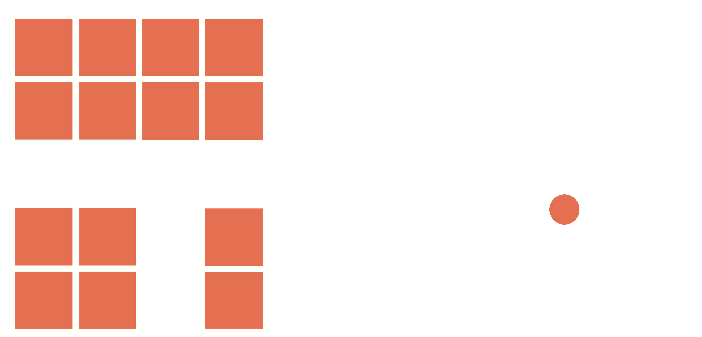
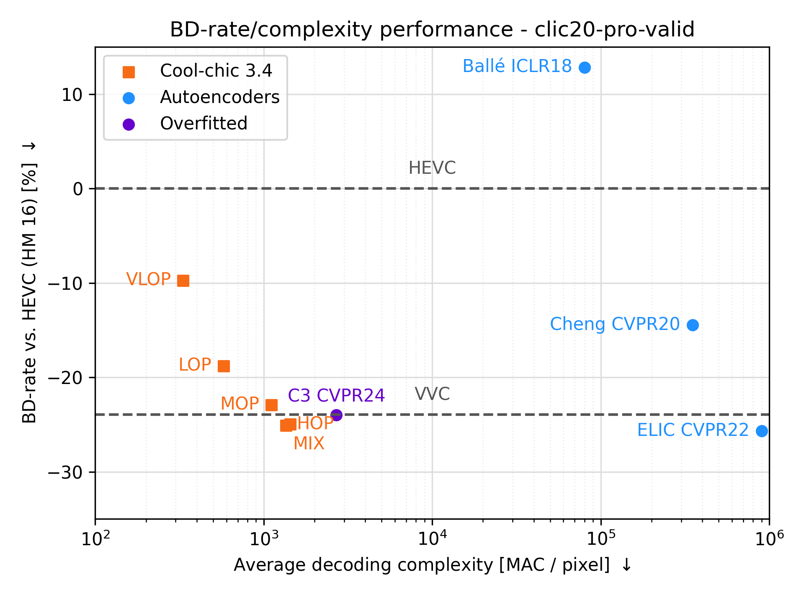

[![Contributors][contributors-shield]][contributors-url]
[![Forks][forks-shield]][forks-url]
[![Stargazers][stars-shield]][stars-url]
[![Issues][issues-shield]][issues-url]
[![BSD-3 License][license-shield]][license-url]
[![PyTorch][pytorch-shield]][pytorch-url]


<!-- PROJECT LOGO -->
<br />
<div align="center">

<picture>
  <!-- User prefers light mode: -->
  <source srcset="docs/source/assets/coolchic-logo-light.png" media="(prefers-color-scheme: light)" alt="Cool-chic Logo" height="200"/>

  <!-- User prefers dark mode: -->
  <source srcset="docs/source/assets/coolchic-logo-dark.png"  media="(prefers-color-scheme: dark)" alt="Cool-chic Logo" height="200"/>

  <!-- User has no color preference: -->
  
</picture>
  <p align="center">
    <!-- Low-complexity neural image codec based on overfitting. -->
    <br />
    <a href="https://orange-opensource.github.io/Cool-Chic/"><strong>Explore the docs »</strong></a>
    <br />
    <br />
    <a href="https://orange-opensource.github.io/Cool-Chic/getting_started/results.html">Decode provided bitstreams</a>
    ·
    <a href="https://orange-opensource.github.io/Cool-Chic/getting_started/results.html#clic20-pro-valid">Compression performance</a>
  </p>
</div>

<!-- # What's Cool-chic? -->

Cool-chic (pronounced <span class="ipa">/kul ʃik/</span> as in French 🥖🧀🍷) is
is a low-complexity neural image codec based on overfitting. It offers image coding
performance competitive with *H.266/VVC for 2000 multiplications* per decoded
pixel.

#

### Current & future features

- I/O format
  - ✅ RGB, yuv420 8-bit and 10-bit
  - ❌ yuv444 8-bit and 10-bit
- Decoder
  - ✅ Fast C implementation
  - ✅ Integer computation for the ARM
  - ❌ Complete integerization
  - ❌ Decrease memory footprint & faster decoding
- Coding performance
  - ✅ On par with VVC for image coding
  - ❌ Upcoming improved Cool-chic video


### Latest release: __Cool-chic 3.2: Go fast boiii__ 🔥 🏎️

- **Fast CPU-only decoder** as proposed in [_Overfitted image coding at reduced complexity_, Blard et al.](https://arxiv.org/abs/2403.11651)
    - Decode a 512x768 image in **100 ms**
    - C API for **binary arithmetic coding**
- Encoding time **reduced by 35%**
- Rate **reduction of 5%** compared to Cool-chic 3.1

Check-out the [release history](https://github.com/Orange-OpenSource/Cool-Chic/releases) to see previous versions of Cool-chic.


# Setup

More details are available on the [Cool-chic page](https://orange-opensource.github.io/Cool-Chic/getting_started/quickstart.html)

```bash
# We need to get these packages to compile the C API and bind it to python.
sudo add-apt-repository -y ppa:deadsnakes/ppa && sudo apt update
sudo apt install -y build-essential python3.10-dev pip
git clone https://github.com/Orange-OpenSource/Cool-Chic.git && cd Cool-Chic

# Install create and activate virtual env
python3.10 -m pip install virtualenv
python3.10 -m virtualenv venv && source venv/bin/activate

# Install Cool-chic
pip install -e .

# Sanity check
python -m test.sanity_check
```

You're good to go!


## Performance

The Cool-chic page provides [comprehensive rate-distortion results and compressed bitstreams](https://orange-opensource.github.io/Cool-Chic/getting_started/results.html) allowing
to reproduce the results inside the ```results/``` directory.

| Dataset          | Vs. Cool-chic 3.1                            | Vs. [_C3_, Kim et al.](https://arxiv.org/abs/2312.02753) | Vs. HEVC (HM 16.20)                          | Vs. VVC (VTM 19.1)                           | Avg decoder MAC / pixel          | Avg decoding time [ms]           |
|------------------|----------------------------------------------|----------------------------------------------------------|----------------------------------------------|----------------------------------------------|----------------------------------|----------------------------------|
| kodak            | <span style="color:green" > - 1.9 % </span>  | <span style="color:green"> - 3.5 %  </span>              | <span style="color:green" > - 16.4 % </span> | <span style="color:#f50" > + 4.4 %   </span> | 1880                             | 168                              |
| clic20-pro-valid | <span style="color:green" > - 4.3 % </span>  | <span style="color:green"> - 1.1 %  </span>              | <span style="color:green" > - 24.9 % </span> | <span style="color:green"> - 2.0 %   </span> | 1907                             | 857                              |
| jvet class B     | <span style="color:green" > - 7.2 % </span>  | <span style="color:gray"> /  </span>                     | <span style="color:green" > - 10.9 % </span> | <span style="color:#f50"> + 19.4 %   </span> | 1803                             | 485                              |
<!-- | jvet class C     | <span style="color:green" > - 2.5 % </span>  | <span style="color:gray"> /  </span>                     | <span style="color:green" > - 15.0 % </span> | <span style="color:#f50"> + 10.7 %   </span> | 1942                             | 186                              |
| jvet class D     | <span style="color:green" > - 1.4 % </span>  | <span style="color:gray"> /  </span>                     | <span style="color:green" > - 11.2 % </span> | <span style="color:#f50"> + 11.0 %   </span> | 1086                             | 30                               |
| jvet class E     | <span style="color:green" > - 9.1 % </span>  | <span style="color:gray"> /  </span>                     | <span style="color:green" >  - 2.7 % </span> | <span style="color:#f50"> + 32.5 %   </span> | 1814                             | 332                              |
| jvet class F     | <span style="color:green" > - 3.2 % </span>  | <span style="color:gray"> /  </span>                     | <span style="color:green" > - 32.0 % </span> | <span style="color:#f50"> + 20.2 %   </span> | 2201                             | 456                              | -->


### Kodak

<div style="text-align: center;">
    <!--  -->
    
    
    <!--  -->
</div>
<br/>

### CLIC20 Pro Valid

<div style="text-align: center;">
    <!--  -->
    
    
    <!--  -->
</div>
<br/>

### JVET Class B

<div style="text-align: center;">
    <!--  -->
    
    
    <!--  -->
</div>
<br/>

# Thanks

Special thanks go to Hyunjik Kim, Matthias Bauer, Lucas Theis, Jonathan Richard Schwarz and Emilien Dupont for their great work enhancing Cool-chic: [_C3: High-performance and low-complexity neural compression from a single image or video_, Kim et al.](https://arxiv.org/abs/2312.02753)

<!-- MARKDOWN LINKS & IMAGES -->
<!-- https://www.markdownguide.org/basic-syntax/#reference-style-links -->
[contributors-shield]: https://img.shields.io/github/contributors/Orange-OpenSource/Cool-Chic.svg?style=for-the-badge
[contributors-url]: https://github.com/Orange-OpenSource/Cool-Chic/graphs/contributors
[forks-shield]: https://img.shields.io/github/forks/Orange-OpenSource/Cool-Chic.svg?style=for-the-badge
[forks-url]: https://github.com/Orange-OpenSource/Cool-Chic/network/members
[stars-shield]: https://img.shields.io/github/stars/Orange-OpenSource/Cool-Chic.svg?style=for-the-badge
[stars-url]: https://github.com/Orange-OpenSource/Cool-Chic/stargazers
[issues-shield]: https://img.shields.io/github/issues/Orange-OpenSource/Cool-Chic.svg?style=for-the-badge
[issues-url]: https://github.com/Orange-OpenSource/Cool-Chic/issues
[license-shield]: https://img.shields.io/github/license/Orange-OpenSource/Cool-Chic.svg?style=for-the-badge
[license-url]: https://github.com/Orange-OpenSource/Cool-Chic/blob/master/LICENSE.txt
[pytorch-shield]: https://img.shields.io/badge/PyTorch-0769AD?style=for-the-badge&logo=pytorch&logoColor=white
[pytorch-url]: https://pytorch.org/

<div align="center">

</br>

#

</br>

<picture>
  <!-- User has no color preference: -->
  
</picture>
</div>
