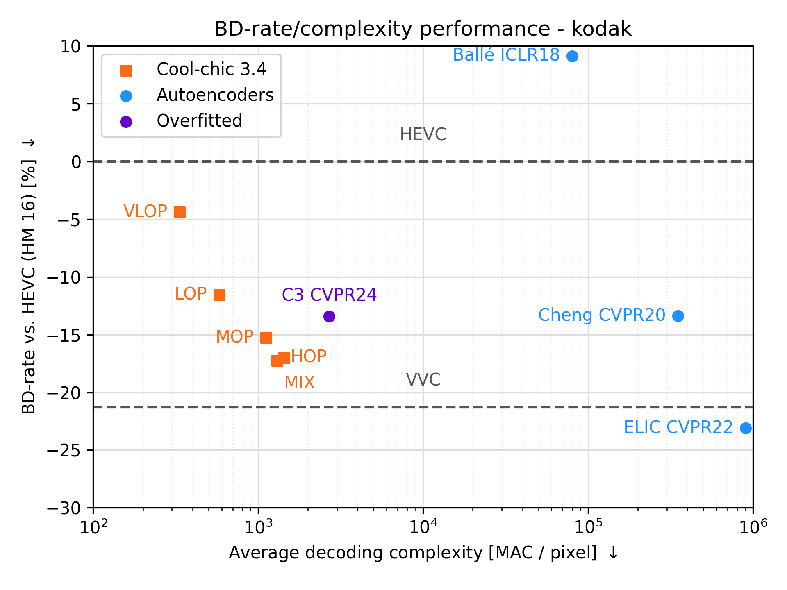

#  🏎️ 🔥 __Cool-chic 3.2: Go fast boiii__ 🔥 🏎️

Cool-chic (pronounced <span class="ipa">/kul ʃik/</span> as in French 🥖🧀🍷) is
is a low-complexity neural image codec based on overfitting. Image
coding performance are __on par with VVC for 2000 multiplications__ per decoded
pixels.

Check out the [Cool-chic documentation page!](https://orange-opensource.github.io/Cool-Chic/)


## Notable improvements

- **Fast CPU-only decoder** as proposed in [_Overfitted image coding at reduced complexity_, Blard et al.](https://arxiv.org/abs/2403.11651)
    - Decode a 512x768 image in **100 ms**
    - C API for **binary arithmetic coding**
- Encoding time **reduced by 35%**
- Rate **reduction of 5%** compared to Cool-chic 3.1

Check-out the [**release history**](https://github.com/Orange-OpenSource/Cool-Chic/releases) to see previous versions of Cool-chic.

# Setup

More details are available on the [Cool-chic page](https://orange-opensource.github.io/Cool-Chic/getting_started/quickstart.html)

```bash
# We need to get these packages to compile the C API and bind it to python.
sudo add-apt-repository -y ppa:deadsnakes/ppa && sudo apt update
sudo apt install -y build-essential python3.10-dev pip
git clone https://github.com/Orange-OpenSource/Cool-Chic.git && cd Cool-Chic

# Install create and activate virtual env
python3.10 -m pip install virtualenv
python3.10 -m virtualenv venv && source venv/bin/activate

# Install Cool-chic
pip install -e .

# Sanity check
python -m test.sanity_check
```

You're good to go!


## Performance

The Cool-chic page provides [comprehensive rate-distortion results and compressed bitstreams](https://orange-opensource.github.io/Cool-Chic/getting_started/results.html) allowing
to reproduce the results inside the ```results/``` directory.

| Dataset          | Vs. Cool-chic 3.1                            | Vs. [_C3_, Kim et al.](https://arxiv.org/abs/2312.02753) | Vs. HEVC (HM 16.20)                          | Vs. VVC (VTM 19.1)                           | Avg decoder MAC / pixel          | Avg decoding time [ms]           |
|------------------|----------------------------------------------|----------------------------------------------------------|----------------------------------------------|----------------------------------------------|----------------------------------|----------------------------------|
| kodak            | <span style="color:green" > - 1.9 % </span>  | <span style="color:green"> - 3.5 %  </span>              | <span style="color:green" > - 16.4 % </span> | <span style="color:#f50" > + 4.4 %   </span> | 1880                             | 168                              |
| clic20-pro-valid | <span style="color:gray" > /</span>          | <span style="color:gray" > /   </span>                   | <span style="color:gray" > / </span>         | <span style="color:gray" > / </span>         |<span style="color:gray" >/</span>|<span style="color:gray" >/</span>|
| jvet             | <span style="color:gray" > / </span>         | <span style="color:gray"> /  </span>                     | <span style="color:gray" > / </span>         | <span style="color:gray" > / </span>         |<span style="color:gray" >/</span>|<span style="color:gray" >/</span>|


### Kodak

<div style="text-align: center;">
    <!--  -->
    
    
    <!--  -->
</div>
<br/>

More results to come in the following days!


# Thanks

Special thanks go to Hyunjik Kim, Matthias Bauer, Lucas Theis, Jonathan Richard Schwarz and Emilien Dupont for their great work enhancing Cool-chic: [_C3: High-performance and low-complexity neural compression from a single image or video_, Kim et al.](https://arxiv.org/abs/2312.02753)
