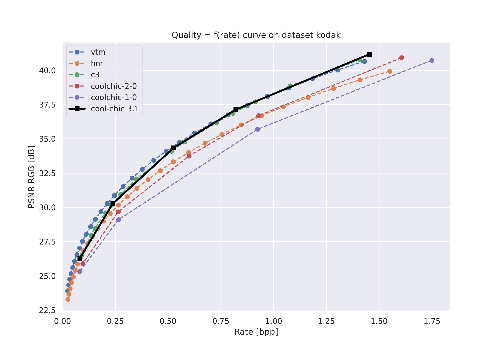
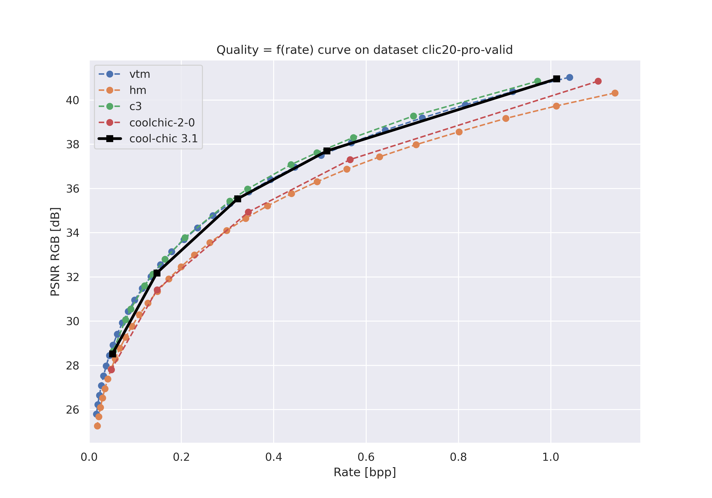
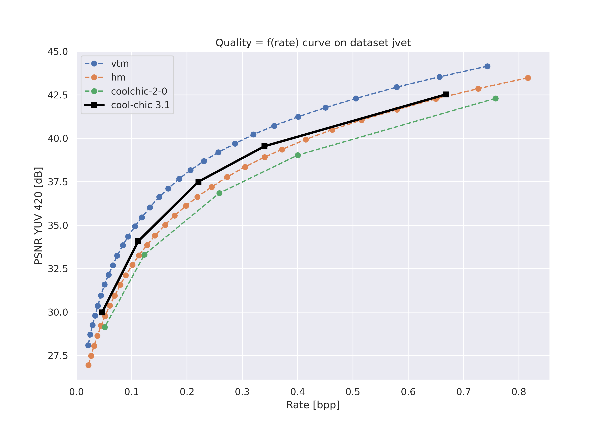
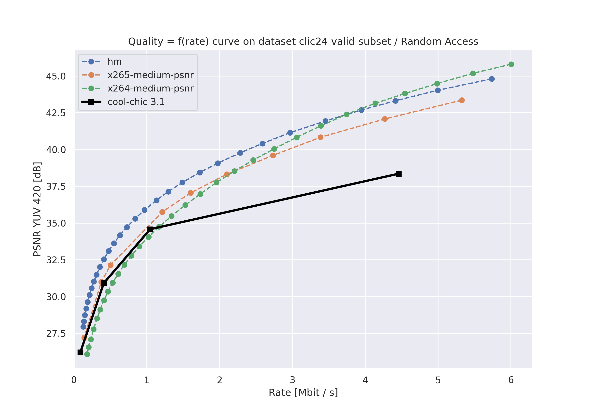
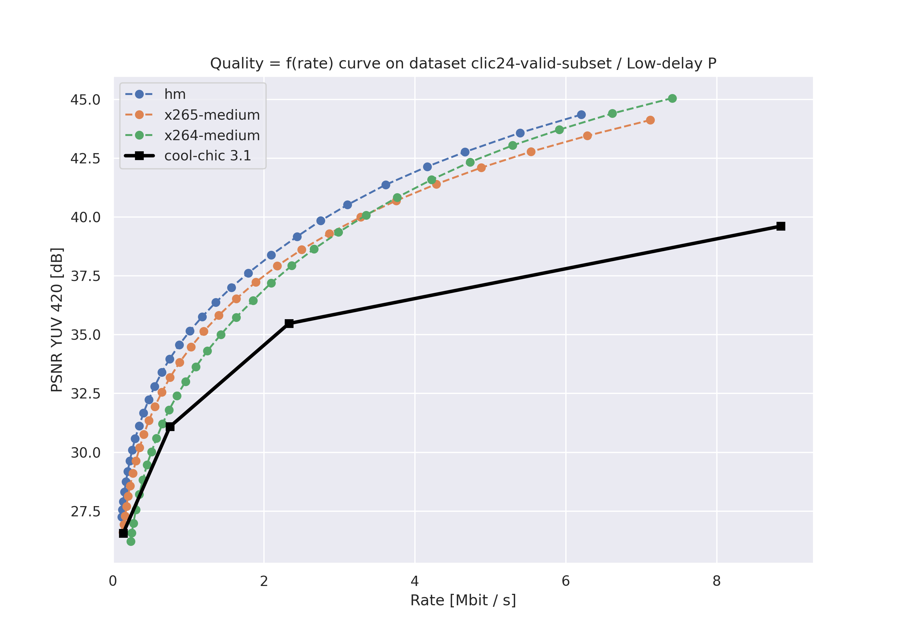

Compression performance
=======================

.. raw:: html

    
    

.. role:: red

.. role:: green

Reproduce our current best results
"""""""""""""""""""""""""""""""""""

We provide already encoded files as bitstreams in ``results/<configuration>/<dataset_name>/``

* ``<configuration>`` can be ``image``, ``video-low-latency``, ``video-random-access``
* ``<dataset_name>`` can be ``kodak, clic20-pro-valid, clic24-valid-subset, jvet``.

These bitstreams allow to reproduce the results stated above qnd reflect the current best rate-distortion results achievable with Cool-chic.

For each dataset, a script decodes all the bitstreams.

.. code:: bash

    (venv) python results/decode_one_dataset.py <configuration> <dataset_name> # Can take a few minutes

The file ``results/<configuration>/<dataset_name>/results.tsv`` provides the results that should be obtained.

Image compression
"""""""""""""""""

Image compression performance are presented on the kodak, clic20-pro-valid and jvet datasets.

The following table sums up the compression performance obtained by Cool-chic 3
against different anchors.

+------------------+---------------------+----------------------+------------------------+-------------------------+------------------------+-----------------------------------------------------------------------------+--------------------------------------+
| Dataset          | vs. Cool-chic 2 [%] | vs. Cool-chic 1 [%]  | vs. C3, Kim et al. [%] | vs. HEVC (HM 16.20) [%] | vs. VVC (VTM 19.1) [%] | Min decoder complexity [MAC / pixel] | Max decoder complexity [MAC / pixel] | Avg decoder complexity [MAC / pixel] |
+==================+=====================+======================+========================+=========================+========================+======================================+======================================+======================================+
| kodak            | \ :green:`-19.4`    | \ :green:`-29.1`     | \ :green:`-1.6`        | \ :green:`-14.6`        | \ :red:`+6.6`          | 299                                  | 2291                                 | 1841                                 |
+------------------+---------------------+----------------------+------------------------+-------------------------+------------------------+--------------------------------------+--------------------------------------+--------------------------------------+
| clic20-pro-valid | \ :green:`-16.8`    | /                    | \ :red:`+3.3`          | \ :green:`-21.4`        | \ :red:`+2.3`          | 545                                  | 2295                                 | 1897                                 |
+------------------+---------------------+----------------------+------------------------+-------------------------+------------------------+--------------------------------------+--------------------------------------+--------------------------------------+
| jvet             | \ :green:`-23.0`    | /                    | /                      | \ :green:`-13.7`        | \ :red:`+25.4`         | 300                                  | 2301                                 | 1680                                 |
+------------------+---------------------+----------------------+------------------------+-------------------------+------------------------+--------------------------------------+--------------------------------------+--------------------------------------+

Video compression
"""""""""""""""""

Video compression performance are presented on the first 33 frames (~= 1 second) from the `CLIC24 validation subset <https://storage.googleapis.com/clic2023_public/validation_sets/clic2024_validation_video_30.zip>`_, composed of 30 high resolution videos. We provide results for 2 coding configurations:

* Low-delay P: address use-cases where low latency is mandatory;
* Random access: address use-cases where compression efficiency is primordial e.g. video streaming.

+---------------------+------------------+-------------------------+----------------------+----------------------+--------------------------------------+--------------------------------------+--------------------------------------+
| Dataset             | Configuration    | vs. HEVC (HM 16.20) [%] | vs. x265 medium. [%] | vs. x264 medium. [%] | Min decoder complexity [MAC / pixel] | Max decoder complexity [MAC / pixel] | Avg decoder complexity [MAC / pixel] |
+=====================+==================+=========================+======================+======================+======================================+======================================+======================================+
| clic24-valid-subset |   random-access  | \ :red:`+60.4`          | \ :red:`+18.1`       | \ :green:`-15.5`     | 460                                  | 460                                  | 460                                  |
+---------------------+------------------+-------------------------+----------------------+----------------------+--------------------------------------+--------------------------------------+--------------------------------------+
| clic24-valid-subset |   low-latency    | \ :red:`+122.0`         | \ :red:`+73.8`       | \ :red:`+28.9`       | 460                                  | 460                                  | 460                                  |
+---------------------+------------------+-------------------------+----------------------+----------------------+--------------------------------------+--------------------------------------+--------------------------------------+
