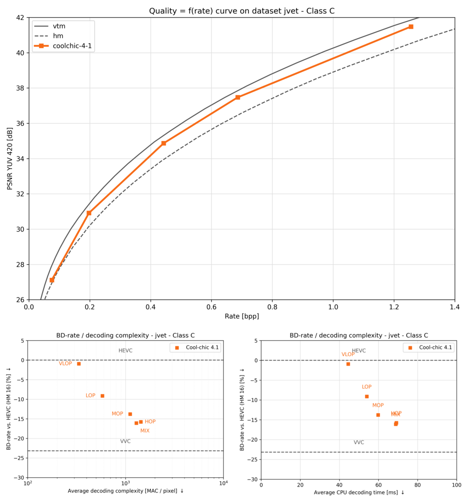
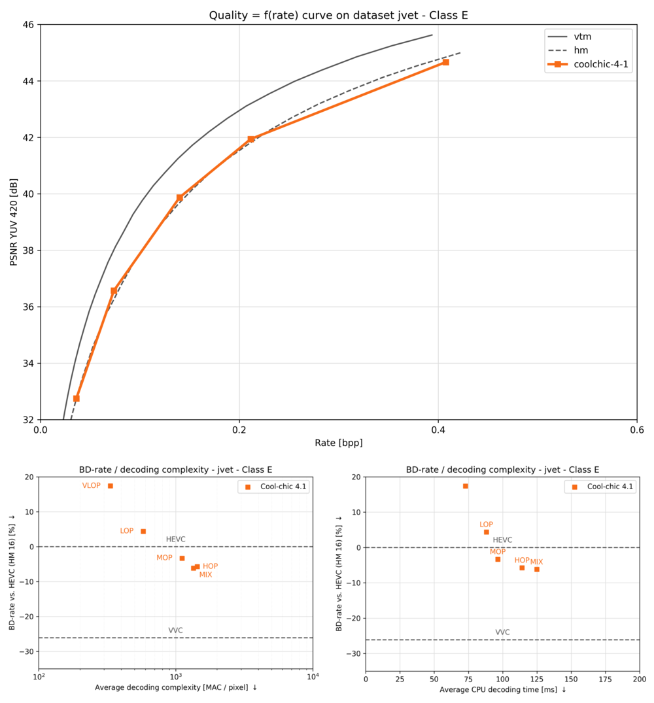
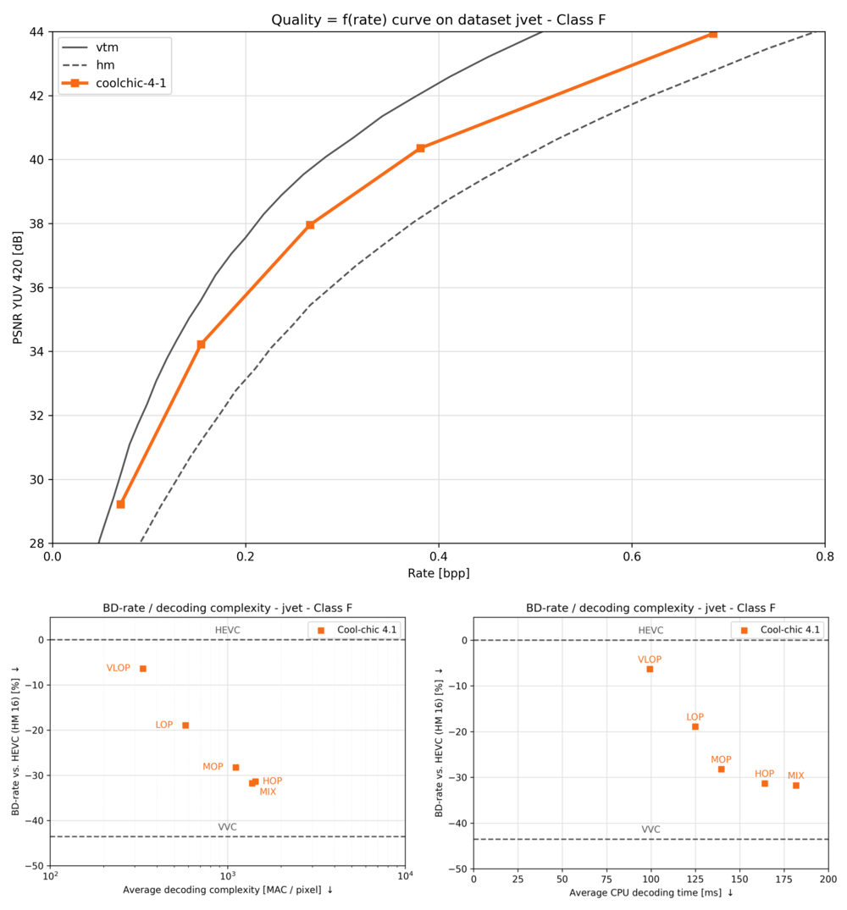

Compression performance
=======================

.. raw:: html

    
    

.. role:: red

.. role:: green

Reproduce our current best results
"""""""""""""""""""""""""""""""""""

We provide already encoded files as bitstreams in ``results/<configuration>/<dataset_name>/``

* ``<configuration>`` can be ``image``
* ``<dataset_name>`` can be ``kodak, clic20-pro-valid, jvet``.

These bitstreams allow to reproduce the results stated above qnd reflect the current best rate-distortion results achievable with Cool-chic.

For each dataset, a script decodes all the bitstreams.

.. code:: bash

    (venv) python results/decode_one_dataset.py <configuration> <dataset_name> # Can take a few minutes

The file ``results/<configuration>/<dataset_name>/results.tsv`` provides the results that should be obtained.

Image compression
"""""""""""""""""

Image compression performance are presented on the kodak dataset, clic20-pro-valid and jvet datasets.

The following table sums up the compression performance obtained by Cool-chic
3.4 against different anchors.

.. raw:: html

  
  <table class="tg"><thead>
    <tr>
      <th class="tg-86ol" rowspan="2"></th>
      <th class="tg-86ol" colspan="6">BD-rate of Cool-chic 3.4 vs. [%]</th>
      <th class="tg-86ol" colspan="2">Avg. decoder complexity</th>
    </tr>
    <tr>
      <th class="tg-86ol"><a href="https://arxiv.org/abs/2001.01568" target="_blank" rel="noopener noreferrer">Cheng</a></th>
      <th class="tg-86ol"><a href="https://arxiv.org/abs/2203.10886" target="_blank" rel="noopener noreferrer">ELIC</a></th>
      <th class="tg-dfl2">Cool-chic 3.3</th>
      <th class="tg-86ol"><a href="https://arxiv.org/abs/2312.02753" target="_blank" rel="noopener noreferrer">C3</a></th>
      <th class="tg-86ol">HEVC (HM 16)</th>
      <th class="tg-86ol">VVC (VTM 19)</th>
      <th class="tg-86ol">MAC / pixel</th>
      <th class="tg-86ol">CPU Time [ms]</th>
    </tr></thead>
  <tbody>
    <tr>
      <td class="tg-86ol">kodak</td>
      <td class="tg-qch7">-4.2 %</td>
      <td class="tg-xd3r">+7.5 %</td>
      <td class="tg-qch7">-0.9 %</td>
      <td class="tg-qch7">-4.3 %</td>
      <td class="tg-qch7">-17.2 %</td>
      <td class="tg-xd3r">+3.4 % </td>
      <td class="tg-dfl2">1303</td>
      <td class="tg-dfl2">74</td>
    </tr>
    <tr>
      <td class="tg-86ol">clic20-pro-valid</td>
      <td class="tg-qch7">-13.2 %</td>
      <td class="tg-qch7">-0.2 %</td>
      <td class="tg-qch7">-0.3 %</td>
      <td class="tg-qch7">-1.3 %</td>
      <td class="tg-qch7">-25.1 %</td>
      <td class="tg-qch7">-2.3 % </td>
      <td class="tg-dfl2">1357</td>
      <td class="tg-dfl2">354</td>
    </tr>
    <tr>
      <td class="tg-86ol">jvet (BCDEF)</td>
      <td class="tg-5niz">/</td>
      <td class="tg-5niz">/</td>
      <td class="tg-qch7">-0.2 %</td>
      <td class="tg-5niz">/</td>
      <td class="tg-qch7">-18.3 %</td>
      <td class="tg-xd3r">+18.6 %</td>
      <td class="tg-dfl2">1249</td>
      <td class="tg-dfl2">143</td>
    </tr>
    <tr>
      <td class="tg-x9uu">jvet (class B)</td>
      <td class="tg-1keu">/</td>
      <td class="tg-1keu">/</td>
      <td class="tg-arzi">+0.9%</td>
      <td class="tg-1keu">/</td>
      <td class="tg-uflc">-9.9 %</td>
      <td class="tg-arzi">+20.7 %</td>
      <td class="tg-m5nv">1300</td>
      <td class="tg-m5nv">282</td>
    </tr>
    <tr>
      <td class="tg-x9uu">jvet (class C)</td>
      <td class="tg-1keu">/</td>
      <td class="tg-1keu">/</td>
      <td class="tg-uflc">-1.3%</td>
      <td class="tg-1keu">/</td>
      <td class="tg-uflc">-16.1 %</td>
      <td class="tg-arzi">+9.2 %</td>
      <td class="tg-m5nv">1289</td>
      <td class="tg-m5nv">69</td>
    </tr>
    <tr>
      <td class="tg-x9uu">jvet (class D)</td>
      <td class="tg-1keu">/</td>
      <td class="tg-1keu">/</td>
      <td class="tg-uflc">-1.4%</td>
      <td class="tg-1keu">/</td>
      <td class="tg-uflc">-12.4 %</td>
      <td class="tg-arzi">+9.6 %</td>
      <td class="tg-m5nv">948</td>
      <td class="tg-m5nv">18</td>
    </tr>
    <tr>
      <td class="tg-x9uu">jvet (class E)</td>
      <td class="tg-1keu">/</td>
      <td class="tg-1keu">/</td>
      <td class="tg-uflc">-3.8%</td>
      <td class="tg-1keu">/</td>
      <td class="tg-uflc">-6.2 %</td>
      <td class="tg-arzi">+27.8 %</td>
      <td class="tg-m5nv">1347</td>
      <td class="tg-m5nv">125</td>
    </tr>
    <tr>
      <td class="tg-x9uu">jvet (class F)</td>
      <td class="tg-1keu">/</td>
      <td class="tg-1keu">/</td>
      <td class="tg-arzi">+0.2%</td>
      <td class="tg-1keu">/</td>
      <td class="tg-uflc">-31.8 %</td>
      <td class="tg-arzi">+20.6 %</td>
      <td class="tg-m5nv">1249</td>
      <td class="tg-m5nv">182</td>
    </tr>
  </tbody></table>

Decoding time are obtained on a single CPU core of an an **AMD EPYC 7282 16-Core
Processor**, PSNR is computed in the **RGB** domain for kodak and CLIC20, in the
**YUV420** domain for jvet

We also present the performance-complexity continuum on Kodak. The different
configurations (*VLOP*, *LOP*, *MOP*, *HOP*) are obtained using the
configuration files detailed in the :doc:`decoder documentation
<./../encoding/architecture>`. For the *MIX* configuration, we pick the best
configuration out of the 4 available ones for each image.

Kodak
*****

.. image:: ../assets/kodak/concat_img.png

CLIC20 Pro Valid
****************

.. image:: ../assets/clic20-pro-valid/concat_img.png
  :alt: CLIC20 rd results

JVET Class B
************

.. image:: ../assets/jvet/concat_img_classB.png
  :alt: JVET class B rd results

JVET Class C
************

JVET Class D
************

JVET Class E
************

JVET Class F
************

JVET All Classes
****************

.. Video compression
.. """""""""""""""""

.. Video compression performance are presented on the first 33 frames (~= 1 second) from the `CLIC24 validation subset <https://storage.googleapis.com/clic2023_public/validation_sets/clic2024_validation_video_30.zip>`_, composed of 30 high resolution videos. We provide results for 2 coding configurations:

.. * Low-delay P: address use-cases where low latency is mandatory;
.. * Random access: address use-cases where compression efficiency is primordial e.g. video streaming.

.. .. image:: ../assets/rd-video-ra-clic24-validsubset.png
..   :alt: CLIC24 random access rd results

.. .. image:: ../assets/rd-video-ldp-clic24-validsubset.png
..   :alt: CLIC24 random access rd results

.. +---------------------+------------------+-------------------------+----------------------+----------------------+--------------------------------------+--------------------------------------+--------------------------------------+
.. | Dataset             | Configuration    | vs. HEVC (HM 16.20) [%] | vs. x265 medium. [%] | vs. x264 medium. [%] | Min decoder complexity [MAC / pixel] | Max decoder complexity [MAC / pixel] | Avg decoder complexity [MAC / pixel] |
.. +=====================+==================+=========================+======================+======================+======================================+======================================+======================================+
.. | clic24-valid-subset |   random-access  | \ :red:`+60.4`          | \ :red:`+18.1`       | \ :green:`-15.5`     | 460                                  | 460                                  | 460                                  |
.. +---------------------+------------------+-------------------------+----------------------+----------------------+--------------------------------------+--------------------------------------+--------------------------------------+
.. | clic24-valid-subset |   low-latency    | \ :red:`+122.0`         | \ :red:`+73.8`       | \ :red:`+28.9`       | 460                                  | 460                                  | 460                                  |
.. +---------------------+------------------+-------------------------+----------------------+----------------------+--------------------------------------+--------------------------------------+--------------------------------------+
