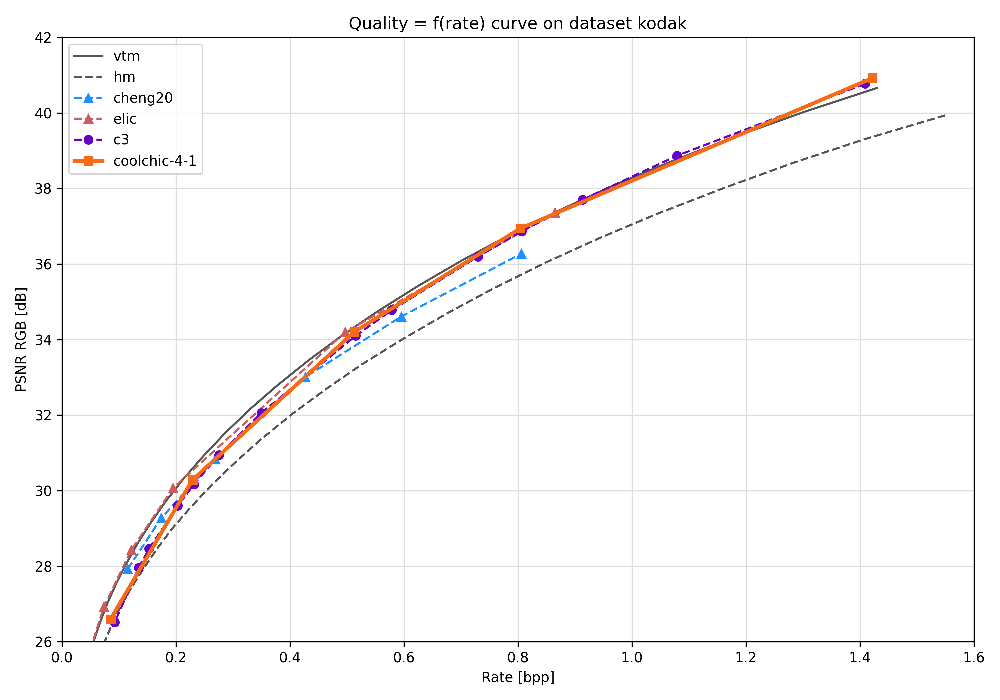

Compression performance
=======================

.. raw:: html

    
    

.. role:: red

.. role:: green

.. note::

    More results to come in the following days. Check-out the repo regularly! 😊

Reproduce our current best results
"""""""""""""""""""""""""""""""""""

We provide already encoded files as bitstreams in ``results/<configuration>/<dataset_name>/``

* ``<configuration>`` can be ``image``
* ``<dataset_name>`` can be ``kodak, clic20-pro-valid, jvet``.

These bitstreams allow to reproduce the results stated above qnd reflect the current best rate-distortion results achievable with Cool-chic.

For each dataset, a script decodes all the bitstreams.

.. code:: bash

    (venv) python results/decode_one_dataset.py <configuration> <dataset_name> # Can take a few minutes

The file ``results/<configuration>/<dataset_name>/results.tsv`` provides the results that should be obtained.

Image compression
"""""""""""""""""

Image compression performance are presented on the kodak dataset.

.. , clic20-pro-valid and jvet datasets.

The following table sums up the compression performance obtained by Cool-chic
3.2 against different anchors.

+------------------+-----------------------+------------------------+-------------------------+------------------------+--------------------------------------+------------------------+
| Dataset          | vs. Cool-chic 3.1 [%] | vs. C3, Kim et al. [%] | vs. HEVC (HM 16.20) [%] | vs. VVC (VTM 19.1) [%] | Avg decoder complexity [MAC / pixel] | Avg decoding time [ms] |
+==================+=======================+========================+=========================+========================+======================================+========================+
| kodak            | \ :green:`-1.9`       | \ :green:`-3.5`        | \ :green:`-16.4`        | \ :red:`+4.4`          | 1880                                 | 168                    |
+------------------+-----------------------+------------------------+-------------------------+------------------------+--------------------------------------+------------------------+
| clic20-pro-valid | /                     | /                      | /                       | /                      | /                                    | /                      |
+------------------+-----------------------+------------------------+-------------------------+------------------------+--------------------------------------+------------------------+
| jvet             | /                     | /                      | /                       | /                      | /                                    | /                      |
+------------------+-----------------------+------------------------+-------------------------+------------------------+--------------------------------------+------------------------+

Kodak
*****

We show below the rate-distortion performance on Kodak:

We also present the performance-complexity continuum on Kodak. The different
configurations (*VLOP*, *LOP*, *MOP*, *HOP*) are obtained using the
configuration files detailed in the :doc:`decoder documentation
<./../encoding/architecture>`. For the *MIX* configuration, we pick the best
configuration out of the 4 available ones for each image.

.. image:: ../assets/kodak/perf_complexity.png
  :alt: Kodak performance-complexity

.. .. image:: ../assets/rd-image-clic20-validpro.png
..   :alt: CLIC20 rd results

.. .. image:: ../assets/rd-image-jvet.png
..   :alt: JVET AI rd results

.. Video compression
.. """""""""""""""""

.. Video compression performance are presented on the first 33 frames (~= 1 second) from the `CLIC24 validation subset <https://storage.googleapis.com/clic2023_public/validation_sets/clic2024_validation_video_30.zip>`_, composed of 30 high resolution videos. We provide results for 2 coding configurations:

.. * Low-delay P: address use-cases where low latency is mandatory;
.. * Random access: address use-cases where compression efficiency is primordial e.g. video streaming.

.. .. image:: ../assets/rd-video-ra-clic24-validsubset.png
..   :alt: CLIC24 random access rd results

.. .. image:: ../assets/rd-video-ldp-clic24-validsubset.png
..   :alt: CLIC24 random access rd results

.. +---------------------+------------------+-------------------------+----------------------+----------------------+--------------------------------------+--------------------------------------+--------------------------------------+
.. | Dataset             | Configuration    | vs. HEVC (HM 16.20) [%] | vs. x265 medium. [%] | vs. x264 medium. [%] | Min decoder complexity [MAC / pixel] | Max decoder complexity [MAC / pixel] | Avg decoder complexity [MAC / pixel] |
.. +=====================+==================+=========================+======================+======================+======================================+======================================+======================================+
.. | clic24-valid-subset |   random-access  | \ :red:`+60.4`          | \ :red:`+18.1`       | \ :green:`-15.5`     | 460                                  | 460                                  | 460                                  |
.. +---------------------+------------------+-------------------------+----------------------+----------------------+--------------------------------------+--------------------------------------+--------------------------------------+
.. | clic24-valid-subset |   low-latency    | \ :red:`+122.0`         | \ :red:`+73.8`       | \ :red:`+28.9`       | 460                                  | 460                                  | 460                                  |
.. +---------------------+------------------+-------------------------+----------------------+----------------------+--------------------------------------+--------------------------------------+--------------------------------------+
