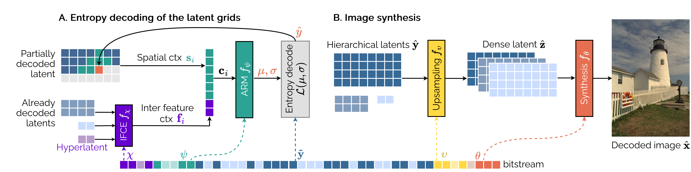

Decoder configuration
=====================

This section details how to change the architecture of the Cool-chic decoder.
The decoder settings of Cool-chic are set in a configuration file. Examples of
such configuration files are located in ``cfg/dec/intra``. They include the following
parameters:

.. list-table:: Parameters relative to the decoder configuration
   :widths: 20 40 40
   :header-rows: 1

   * - Parameter
     - Role
     - Example value
   * - ``latent_resolution_residue``
     - Maximal and minimal resolution of the latent grids.
     - ``0-6`` for latent resolution 1:1 to 1::math:`2^6`
   * - ``hyperlatent_resolution_residue``
     - Maximal and minimal resolution of the hyperlatent grids.
     - ``4-6`` for latent resolution 1::math:`2^4` to 1::math:`2^6`
   * - ``arm_residue``
     - ARM architecture
     - ``20,2/stabiliser``
   * - ``output_feature_ifce_residue``
     - Number of context exctracted by the IFCE
     - ``6``
   * - ``ifce_resolution_residue``
     - Maximal and minimal resolution of latent using the IFCE
     - ``0-2``
   * - ``layers_synthesis_residue``
     - Synthesis architecture
     - ``48-1-linear-relu,3-1-linear-none,X-3-residual-relu,X-3-residual-none``
   * - ``ups_k_size_residue``
     - Upsampling filter size
     - ``8``
   * - ``ups_preconcat_k_size_residue``
     - Pre-concatenation upsampling filter size
     - ``8``

.. tip::

    Each parameter listed in the configuration file can be overridden through a
    command line argument:

    .. code:: bash

        (venv) ~/Cool-Chic$ python cc_encode.py \
          --dec_cfg_residue=cfg/dec/intra/lop.cfg # lop.cfg has dim_arm=8,2
          --arm_residue=16,2                      # This override the value present in lop.cfg

.. _decoder_cfg_files:

Some existing configuration files
"""""""""""""""""""""""""""""""""

Some configuration files are proposed in ``cfg/dec/intra/``:

.. list-table:: Existing decoder configuration files.
   :widths: 20 40 40
   :header-rows: 1

   * - Name
     - Description
     - Multiplication / decoded pixel
   * - ``lop.cfg``
     - Low Operating Point
     - 500
   * - ``mop.cfg``
     - Medium Operating Point
     - 1000
   * - ``hop.cfg``
     - High Operating Point
     - 2000
   * - ``vhop.cfg``
     - Very High Operating Point
     - 3000

The `Cool-chic 5.0: paper <https://arxiv.org/abs/2412.00505>`_ presents the
performance of these different decoder configurations.

.. tip::

    A good deal of useful info are logged inside the working directory specified
    when encoding an image or video.

    .. code:: bash

        (venv) ~/Cool-Chic$ python cc_encode.py   \
          --input=path_to_my_example                    \
          --output=bitstream.cool                       \
          --workdir=./my_temporary_workdir/

    The file ``./my_temporary_workdir/XXXX-archi.txt`` contains the
    detailed Cool-chic architecture, number of parameters and number of
    multiplications.

Latent dimension ``--latent_resolution_residue``
""""""""""""""""""""""""""""""""""""""""""""""""

Most of the information about the frame to decode is stored inside a set of
**hierarchical** latent grids. This is parameterized by indicating the number of
features for each resolution separated by comas.

Using a ``512x768`` image from the Kodak dataset as an example gives the
following latent dimensions

.. code-block:: none

  (venv) ~/Cool-Chic$ python cc_encode.py --input=kodim01.png --latent_resolution_residue=0-3

  cat ./0000-archi.txt

  | module                                  | #parameters or shape   | #flops   |
  |:----------------------------------------|:-----------------------|:---------|
  | model                                   |                        |          |
  |  latent_grids                           |                        |          |
  |   latent_grids.0                        |   (1, 1, 512, 768)     |          |
  |   latent_grids.1                        |   (1, 1, 256, 384)     |          |
  |   latent_grids.2                        |   (1, 1, 128, 192)     |          |
  |   latent_grids.3                        |   (1, 1, 64, 96)       |          |

.. tip::

  Use ``--latent_resolution_residue=auto`` to automatically change the number of
  latent grids depending on the image size.

.. _no_high_res_latent:

.. attention::

    If there is no higher resolution latent *e.g.*
    ``--latent_resolution_residue=2-3`` the upsampling stops at the highest
    latent resolution (here 1/4). Then, the dense representation goes to the
    synthesis and the output is still at the highest latent resolution (*e.g.*
    1/4). In that case, a final upsampling is performed to get to the desired
    full resolution.

Hyperlatent dimension ``--hyperlatent_resolution_residue``
""""""""""""""""""""""""""""""""""""""""""""""""""""""""""

Hyperlatent grids are parameterized similarly to the main latent grids.

Using a ``512x768`` image from the Kodak dataset as an example gives the
following latent dimensions

.. code-block:: none

  (venv) ~/Cool-Chic$ python cc_encode.py --input=kodim01.png --latent_resolution_residue=0-1 --hyperlatent_resolution_residue=2-3

  cat ./0000-archi.txt

  | module                                  | #parameters or shape   | #flops   |
  |:----------------------------------------|:-----------------------|:---------|
  | model                                   |                        |          |
  |  latent_grids                           |                        |          |
  |   latent_grids.0                        |   (1, 1, 512, 768)     |          |   # Main latent grids
  |   latent_grids.1                        |   (1, 1, 256, 384)     |          |   # Main latent grids
  |   latent_grids.2                        |   (1, 1, 128, 192)     |          |   # Hyperlatent grids
  |   latent_grids.3                        |   (1, 1, 64, 96)       |          |   # Hyperlatent grids

.. tip::

  Use ``--hyperlatent_resolution_residue=auto`` to automatically change the number of
  hyperlatent grids depending on the image size.

Autoregressive module (ARM) ``--arm_residue``
"""""""""""""""""""""""""""""""""""""""""""""

The autoregressive probability module (ARM) predict the distribution of a given
latent pixel given its neighboring pixels, driving the entropy coder. It is
tuned by a single parameter ``--arm_residue=<X>,<Y>/stabiliser`` serving two purposes:

* The first number ``X`` represents both the number of **spatial context pixels** and
  the number of **hidden features** for all hidden layers.

* The second number ``Y`` sets the number of hidden layer(s). Setting it to 0
  gives a single-layer linear ARM.

* Use ``/stabiliser`` to enable the linear stabiliser residual layer around the ARM.

.. note::

    The ARM always has the same number of output features: 2. One is for the
    expectation :math:`\mu` and the other is a re-parameterization of the
    Laplace scale :math:`4 + \ln b`.

.. attention::

    Due to implementation constraints, we impose the following restrictions on
    the ARM architecture:

    * All layers except the output one are **residual** followed with a **ReLU** activation

Inter-Feature Context Extractor (IFCE)
""""""""""""""""""""""""""""""""""""""

IFCE are linear layers dedicated to individual latent grids, used to extract
context vectors from already decoded latent grids. Use
``--output_feature_ifce_residue`` to specify the dimension of these context
vectors. Use ``ifce_resolution_residue`` to specify the resolution of the latent
benefiting from the IFCE.

Upsampling
""""""""""

The upsampling network takes the set of hierarchical latent variables and
upsample them to obtain a dense latent representation with the same resolution
than the image to decode e.g. ``[C, H, W]`` for a ``H, W`` image. This is
achieved through successive upsampling of the latent using 2d convolutions. The
size of these convolutive filters are parameterized with ``--ups_k_size_residue`` and
``--ups_preconcat_k_size_residue``.

See the :doc:`upsampling doc <./../../code_documentation/upsampling>` for more details.

Synthesis
"""""""""

The synthesis transform is a convolutive network mapping the dense latent input
``[C, H, W]`` to a ``X, H, W`` output. The number of output feature ``X`` depends
on the type of frame:

* I (intra) frames have ``X = 3`` output channels *e.g.* RGB or YUV. This is the
  case for still image compression.

The synthesis is tuned by a single parameter
``--layers_synthesis_residue=<layer1>,<layer2>/stabiliser`` which describes all layers, separated
by comas. Each layer is decomposed as follows:

.. code-block:: none

  <output_dim>-<kernel_size>-<type>-<non_linearity>

* ``output_dim`` is the number of output features. Set the last layer(s) to ``X`` to be
  automatically replaced by the appropriate value according to the frame type.

* ``kernel_size`` is the size of the convolution kernel

* ``type`` is either ``linear`` (normal convolution) or ``residual`` (convolution + skip connection)

* ``non_linearity`` can be ``relu`` or ``none``

.. note::

    The number of input features for each layer is automatically inferred from
    the previous one or from the number of latent features.

Use ``/stabiliser`` to enable the linear stabiliser residual layer around the ARM.

