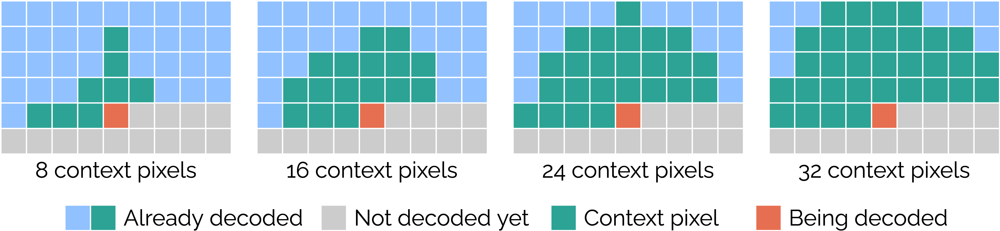

Decoder configuration
=====================

.. image:: ../assets/overview.png
  :alt: Cool-chic decoder overview

This section details how to change the architecture of the Cool-chic decoder.
The decoder settings of Cool-chic are set in a configuration file. Examples of
such configuration files are located in ``cfg/dec/intra_residue``. They include the following
parameters:

.. list-table:: Parameters relative to the decoder configuration
   :widths: 20 40 40
   :header-rows: 1

   * - Parameter
     - Role
     - Example value
   * - ``n_ft_per_res_residue``
     - Number of features per latent resolution
     - ``1,1,1,1,1,1,1``
   * - ``arm_residue``
     - ARM architecture
     - ``16,2``
   * - ``layers_synthesis_residue``
     - Synthesis architecture
     - ``48-1-linear-relu,3-1-linear-none,X-3-residual-relu,X-3-residual-none``
   * - ``ups_k_size_residue``
     - Upsampling filter size
     - ``8``
   * - ``ups_preconcat_k_size_residue``
     - Pre-concatenation upsampling filter size
     - ``8``

.. tip::

    Each parameter listed in the configuration file can be overridden through a
    command line argument:

    .. code:: bash

        (venv) ~/Cool-Chic$ python coolchic/encode.py \
          --dec_cfg_residue=cfg/dec/intra_residue/lop.cfg # lop.cfg has dim_arm=8,2
          --arm_residue=16,2                              # This override the value present in lop.cfg

.. _decoder_cfg_files:

Some existing configuration files
"""""""""""""""""""""""""""""""""

Some configuration files are proposed in ``cfg/dec/intra_residue/``:

.. list-table:: Existing decoder configuration files.
   :widths: 20 40 40
   :header-rows: 1

   * - Name
     - Description
     - Multiplication / decoded pixel
   * - ``vlop.cfg``
     - Very Low Operating Point
     - 330
   * - ``lop.cfg``
     - Low Operating Point
     - 580
   * - ``mop.cfg``
     - Medium Operating Point
     - 1110
   * - ``hop.cfg``
     - High Operating Point
     - 1430

The :doc:`results section <./../results/image/decoding_complexity>` illustrates the performance-complexity continuum of these configurations.

.. tip::

    Many useful info are logged inside the workdir specified when encoding an
    image or video.

    .. code:: bash

        (venv) ~/Cool-Chic$ python coolchic/encode.py   \
          --input=path_to_my_example                    \
          --output=bitstream.bin                        \
          --workdir=./my_temporary_workdir/

    The file ``./my_temporary_workdir/XXXX-archi.txt`` contains the
    detailed Cool-chic architecture, number of parameters and number of
    multiplications.

Latent dimension
""""""""""""""""

Most of the information about the frame to decode is stored inside a set of
**hierarchical** latent grids. This is parameterized by indicating the number of
features for each resolution separated by comas.

.. attention::

    Due to implementation constraints, we currently only support one feature per
    latent resolution *e.g* ``--n_ft_per_res_residue=1,1,1,1``

Using a ``512x768`` image from the Kodak dataset as an exemple gives the
following latent dimensions

.. code-block:: none

  (venv) ~/Cool-Chic$ python coolchic/encode.py --input=kodim01.png --n_ft_per_res_residue=1,1,1,1

  cat ./0000-archi.txt

  | module                                  | #parameters or shape   | #flops   |
  |:----------------------------------------|:-----------------------|:---------|
  | model                                   |                        |          |
  |  latent_grids                           |                        |          |
  |   latent_grids.0                        |   (1, 1, 512, 768)     |          |
  |   latent_grids.1                        |   (1, 1, 256, 384)     |          |
  |   latent_grids.2                        |   (1, 1, 128, 192)     |          |
  |   latent_grids.3                        |   (1, 1, 64, 96)       |          |

Auto-regressive module (ARM)
""""""""""""""""""""""""""""

The auto-regressive probability module (ARM) predict the distribution of a given
latent pixel given its neighboring pixels, driving the entropy coder. It is
tuned by a single parameter ``--arm_residue=<X>,<Y>`` serving two purposes:

* The first number ``X`` represents both the number of **context pixels** and
  the number of **hidden features** for all hidden layers.

* The second number ``Y`` sets the number of hidden layer(s). Setting it to 0
  gives a single-layer linear ARM.

.. note::

    The ARM always has the same number of output features: 2. One is for the
    expectation :math:`\mu` and the other is a re-parameterization of the
    Laplace scale :math:`4 + \ln b`.

.. attention::

    Due to implementation constraints, we impose the following restrictions on
    the ARM architecture:

    * The number of context pixels and hidden features are identical and must be a **multiple of 8**

    * All layers except the output one are **residual** followed with a **ReLU** activation

The different context patterns are as follows:

Using a ``512x768`` image from the Kodak dataset as an exemple:

.. code-block:: none

  (venv) ~/Cool-Chic$ python coolchic/encode.py --input=kodim01.png --arm_residue=16,2

  ARM 725 MAC/pixel ; 53.5 % of the complexity
  ============================================

                     +----------------------------+                  +----------------------------+
                     |                            |                  |                            |
                     |                            v                  |                            v
                     |  +-----------------+    +-----+    +------+   |  +-----------------+    +-----+    +------+      +----------------+
  16-pixel context ---> | Linear 16 -> 16 | -> |  +  | -> | ReLU | ---> | Linear 16 -> 16 | -> |  +  | -> | ReLU | ---> | Linear 16 -> 2 | ---> mu, log scale
                        +-----------------+    +-----+    +------+      +-----------------+    +-----+    +------+      +----------------+

Upsampling
""""""""""

The upsampling network takes the set of hierarchical latent variables and
upsample them to obtain a dense latent representation with the same resolution
than the image to decode e.g. ``[C, H, W]`` for a ``H, W`` image. This is
achieved through successive upsampling of the latent using 2d convolutions. The
size of these convolutive filters are parameterized with ``--ups_k_size_residue`` and
``--ups_preconcat_k_size_residue``.

See the :doc:`upsampling doc <./../../code_documentation/encoder/component/core/upsampling>` for more details.

Synthesis
"""""""""

The synthesis transform is a convolutive network mapping the dense latent input
``[C, H, W]`` to a ``X, H, W`` output. The number of output feature ``X`` depends
on the type of frame:

* I (intra) frames have ``X = 3`` output channels *e.g.* RGB or YUV. This is the
  case for still image compression.

The synthesis is tuned by a single parameter
``--layers_synthesis_residue=<layer1>,<layer2>`` which describes all layers, separated
by comas. Each layer is decomposed as follows:

.. code-block:: none

  <output_dim>-<kernel_size>-<type>-<non_linearity>

* ``output_dim`` is the number of output features. Set the last layer(s) to ``X`` to be
  automatically replaced by the appropriate value according to the frame type.

* ``kernel_size`` is the size of the convolution kernel

* ``type`` is either ``linear`` (normal convolution) or ``residual`` (convolution + skip connexion)

* ``non_linearity`` can be ``relu`` or ``none``

.. note::

    The number of input features for each layer is automatically inferred from
    the previous one or from the number of latent features.

.. tip::

    The C implementation of Cool-chic decoder is optimized for the most common
    synthesis architectures. If the first two layers are 1x1 convolutions, they
    are fused together. 3x3 convolutions at the end of the synthesis have their
    dedicated faster implementation.

Using a ``512x768`` image from the Kodak dataset and 7 input features as an exemple:

.. code-block:: none

  (venv) ~/Cool-Chic$ python coolchic/encode.py \
    --input=kodim01.png \
    --n_ft_per_res_residue=1,1,1,1,1,1,1 \
    --layers_synthesis_residue=16-1-linear-relu,3-1-linear-relu,X-3-residual-relu,X-3-residual-none

  Synthesis 322 MAC/pixel ; 28.9 % of the complexity
  ==================================================

                                                                                               +------------------------------+                  +------------------------------+
                                                                                               |                              |                  |                              |
                                                                                               |                              v                  |                              v
                  +--------------------+    +------+      +--------------------+    +------+   |  +-------------------+    +-----+    +------+   |  +-------------------+    +-----+
  7 features ---> | 1x1 Conv2d 7 -> 16 | -> | ReLU | ---> | 1x1 Conv2d 16 -> 3 | -> | ReLU | ---> | 3x3 Conv2d 3 -> 3 | -> |  +  | -> | ReLU | ---> | 3x3 Conv2d 3 -> 3 | -> |  +  | ---> Decoded image
                  +--------------------+    +------+      +--------------------+    +------+      +-------------------+    +-----+    +------+      +-------------------+    +-----+