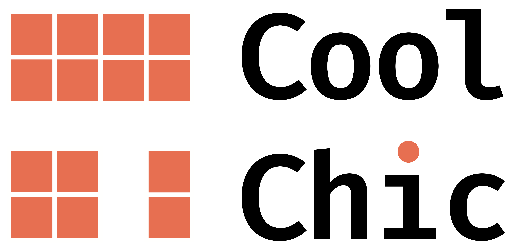

.. raw:: html

    

.. role:: gray

.. raw:: html

   

   

       
      <a href="https://orange-opensource.github.io/Cool-Chic/getting_started/results.html">Decode provided bitstreams</a>
      ·
      <a href="https://orange-opensource.github.io/Cool-Chic/getting_started/results.html#clic20-pro-valid">Compression performance</a>
   

   

**Cool-chic** (pronounced :gray:`/kul ʃik/` as in French 🥖🧀🍷) is a
low-complexity neural image codec based on overfitting. It offers image coding
performance competitive with H.266/VVC for 2000 multiplications per decoded
pixel.

Current & future features
"""""""""""""""""""""""""

.. raw:: html

   &nbsp; &nbsp;⚬ &nbsp; &nbsp;<b>Coding performance</b>
    
   &nbsp; &nbsp;&nbsp; &nbsp; - &nbsp; ✅ On par with VVC for image coding
    
   &nbsp; &nbsp;&nbsp; &nbsp; - &nbsp; ❌ Upcoming improved Cool-chic video
    
    
   &nbsp; &nbsp;⚬ &nbsp;<b>I/O format</b>
    
   &nbsp; &nbsp;&nbsp; &nbsp; - &nbsp;✅ PPM for 8-bit RGB images, yuv420 8-bit and 10-bit
    
   &nbsp; &nbsp;&nbsp; &nbsp; - &nbsp;❌ yuv444
    
   &nbsp; &nbsp;&nbsp; &nbsp; - &nbsp;❌ Additional output precisions (12, 14 and 16-bit)
    
   &nbsp; &nbsp;&nbsp; &nbsp; - &nbsp;❌ Output PNG instead of PPM for the decoded images
    
    
   &nbsp; &nbsp;⚬ &nbsp;<b>Decoder</b>
    
   &nbsp; &nbsp;&nbsp; &nbsp; - &nbsp; ✅ Fast C implementation
    
   &nbsp; &nbsp;&nbsp; &nbsp; - &nbsp; ✅ Integer computation ARM
    
   &nbsp; &nbsp;&nbsp; &nbsp; - &nbsp; ✅ Complete integerization
    
   &nbsp; &nbsp;&nbsp; &nbsp; - &nbsp; ✅ Decrease memory footprint & faster decoding
    
    
    

Cool-chic 3.2 improvements
""""""""""""""""""""""""""

* Make the **CPU-only decoder** even faster

  * Decode a 720p image in **100 ms**, **2x faster** than Cool-chic 3.2
  * Full **integerization** of the decoder for replicability
  * Reduce decoder **memory footprint**
  * **Optimized** implementation of 3x3 convolutions & fusion of successive 1x1 convolutions

Check-out the `release history
<https://github.com/Orange-OpenSource/Cool-Chic/releases>`_ to see previous
versions of Cool-chic.

.. attention::

   🛑 Cool-chic 3.3 temporarily disables video coding. If you really want to
   compress videos you can

   * Go back to 3.1: ``git clone --branch v3.1
     https://github.com/Orange-OpenSource/Cool-Chic.git``

   * Wait for Cool-chic 4.0 for better and faster video coding 😉.

Thanks
""""""

Special thanks go to:

* **Hyunjik Kim, Matthias Bauer, Lucas Theis, Jonathan Richard Schwarz and Emilien
  Dupont** for their great work enhancing Cool-chic: `C3: High-performance and
  low-complexity neural compression from a single image or video, Kim et al.
  <https://arxiv.org/abs/2312.02753>`_

.. image:: assets/logo_orange.png
  :align: center
  :height: 150
  :alt: Logo orange

.. toctree::
   :maxdepth: 1
   :caption: Getting started
   :hidden:

   Quickstart <getting_started/quickstart>
   Example <getting_started/example>

.. toctree::
   :maxdepth: 1
   :caption: Decoding
   :hidden:

   Decoding a bitstream <decoding/decoding_images>

.. toctree::
   :maxdepth: 1
   :caption: Encoding your own files
   :hidden:

   Overview <encoding/overview>
   Decoder configuration <encoding/architecture>
   Encoder configuration <encoding/preset>

.. Video <encoding/video>

.. toctree::
   :maxdepth: 1
   :caption: Compression performance
   :hidden:

   Results <getting_started/results>
   Literature <getting_started/literature>

.. toctree::
   :caption: Code Documentation
   :hidden:

   At a glance <code_documentation/overview>
   Encoder <code_documentation/encoder/index>

.. Decoder <code_documentation/decoder/index>

.. .. toctree::
..    :maxdepth: 1
..    :caption: Code Documentation

..    encoding_management <encoding_management>
..    models <models>
..    utils <utils>
..    visu <visu>

