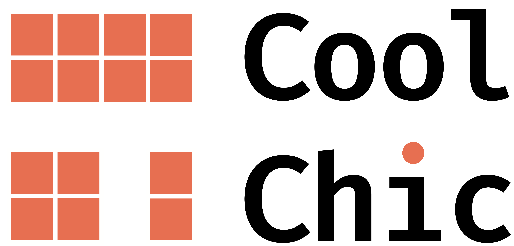

:layout: landing
:description: Cool-chic is a low-complexity neural image and video codec,
    offering image coding performance on par with VVC and fast CPU-only decoding.

.. raw:: html

    

.. role:: accent

.. Cool-chic
.. =========

.. rst-class:: lead

   Cool-chic (pronounced :accent:`/kul ʃik/` as in French 🥖🧀🍷) is a low-complexity neural image and video codec based on overfitting. It achieves
   state-of-the-art image compression performance, while requiring only 1000
   multiplications per decoded pixel.

|

.. container:: buttons

   `Docs <https://orange-opensource.github.io/Cool-Chic/getting_started/quickstart.html>`_
   `Release note <https://orange-opensource.github.io/Cool-Chic/getting_started/new_stuff.html>`_
   `Image coding performance <https://orange-opensource.github.io/Cool-Chic/results/image.html>`_
   `Video coding performance <https://orange-opensource.github.io/Cool-Chic/results/video.html>`_

|

.. image:: assets/logo_orange.png
   :width: 150
   :align: center
   :alt: Logo Orange

|

|

.. toctree::
   :maxdepth: 1
   :caption: Getting started
   :hidden:

   Quickstart <getting_started/quickstart>
   What's new in 5.0? <getting_started/new_stuff>
   Example <getting_started/example>
   Literature <getting_started/literature>

.. toctree::
   :maxdepth: 1
   :caption: Image coding
   :hidden:

   Overview <image_compression/overview>
   Decoder configuration <image_compression/architecture>
   Encoder configuration <image_compression/preset>
   Decoding a bitstream <image_compression/decoding_images>

.. toctree::
   :maxdepth: 1
   :caption: Video coding
   :hidden:

   Overview <video_compression/overview>
   Decoder configuration <video_compression/architecture>
   Encoder configuration <video_compression/encoding>

.. toctree::
   :maxdepth: 1
   :caption: Compression performance
   :hidden:

   Image <results/image>
   Video <results/video>

.. toctree::
   :caption: Code Documentation
   :hidden:

   At a glance <code_documentation/overview>
   Cool-chic <code_documentation/coolchic>
   ARM <code_documentation/arm>
   Quantizer <code_documentation/quantizer>
   Upsampling <code_documentation/upsampling>
   Synthesis <code_documentation/synthesis>

.. Decoder <code_documentation/decoder/index>

.. .. toctree::
..    :maxdepth: 1
..    :caption: Code Documentation

..    encoding_management <encoding_management>
..    models <models>
..    utils <utils>
..    visu <visu>

