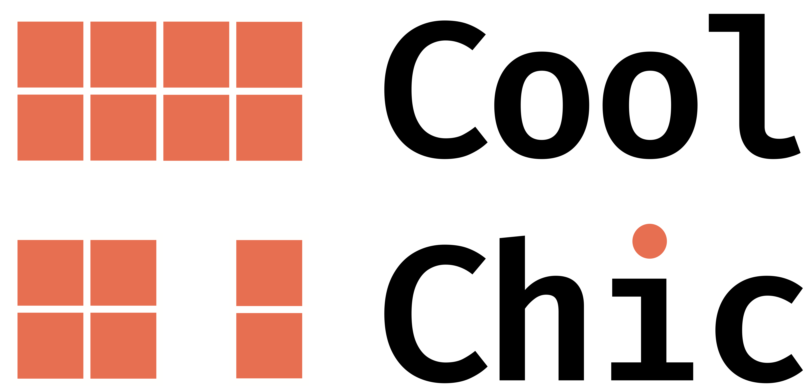

:layout: landing
:description: Cool-chic is a low-complexity neural image codec, offering coding
    performance on par with VVC and fast CPU-only decoding.

.. raw:: html

    

.. role:: accent

.. Cool-chic
.. =========

.. rst-class:: lead

   Cool-chic (pronounced :accent:`/kul ʃik/` as in French 🥖🧀🍷) is a low-complexity neural
   image codec based on overfitting. It offers coding performance on par with
   H.266/VVC for 1000 multiplications per decoded pixel, allowing for fast
   CPU-only decoding.

.. container:: buttons

   `Docs <https://orange-opensource.github.io/Cool-Chic/getting_started/quickstart.html>`_
   `What's new in 3.4? <https://orange-opensource.github.io/Cool-Chic/getting_started/new_stuff.html>`_
   `Decode some bitstreams <https://orange-opensource.github.io/Cool-Chic/getting_started/results.html>`_
   `Coding performance <https://orange-opensource.github.io/Cool-Chic/getting_started/results.html#clic20-pro-valid>`_

.. grid:: 1 1 1 2
    :gutter: 2
    :class-row: surface

    .. grid-item-card:: :octicon:`trophy` Great coding performance
      :link: https://orange-opensource.github.io/Cool-Chic/getting_started/results.html

      Cool-chic compresses images as well as H.266/VVC

    .. grid-item-card:: :octicon:`rocket` Fast CPU-only decoder
      :link: https://orange-opensource.github.io/Cool-Chic/getting_started/results.html

      Decode a 1280x720 image in 100 ms on CPU with our decoder written in C

    .. grid-item-card:: :octicon:`flame` Fixed-point decoder

        Fixed-point arithmetic at the decoder for bit-exact results on different
        hardwares.

    .. grid-item-card:: :octicon:`file-media` I/O format
        :link: https://orange-opensource.github.io/Cool-Chic/encoding/overview.html#i-o-format

        Encode PNG, PPM and YUV file with a bitdepth of 8 to 16
        bits.

|

|

.. image:: assets/logo_orange.png
   :height: 100
   :align: center
   :alt: Logo Orange

|

|

Special thanks to **Hyunjik Kim, Matthias Bauer, Lucas Theis, Jonathan Richard
Schwarz and Emilien Dupont** for their great work enhancing Cool-chic: `C3:
High-performance and low-complexity neural compression from a single image or
video, Kim et al. <https://arxiv.org/abs/2312.02753>`_

.. toctree::
   :maxdepth: 1
   :caption: Getting started
   :hidden:

   Quickstart <getting_started/quickstart>
   What's new in 3.4? <getting_started/new_stuff>
   Example <getting_started/example>

.. toctree::
   :maxdepth: 1
   :caption: Decoding
   :hidden:

   Decoding a bitstream <decoding/decoding_images>

.. toctree::
   :maxdepth: 1
   :caption: Encoding your own files
   :hidden:

   Overview <encoding/overview>
   Decoder configuration <encoding/architecture>
   Encoder configuration <encoding/preset>

.. Video <encoding/video>

.. toctree::
   :maxdepth: 1
   :caption: Compression performance
   :hidden:

   Results <getting_started/results>
   Literature <getting_started/literature>

.. toctree::
   :caption: Code Documentation
   :hidden:

   At a glance <code_documentation/overview>
   enc <code_documentation/encoder/index>

.. Decoder <code_documentation/decoder/index>

.. .. toctree::
..    :maxdepth: 1
..    :caption: Code Documentation

..    encoding_management <encoding_management>
..    models <models>
..    utils <utils>
..    visu <visu>

