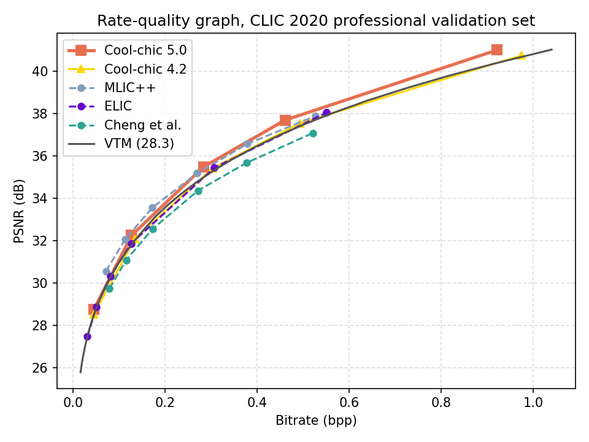
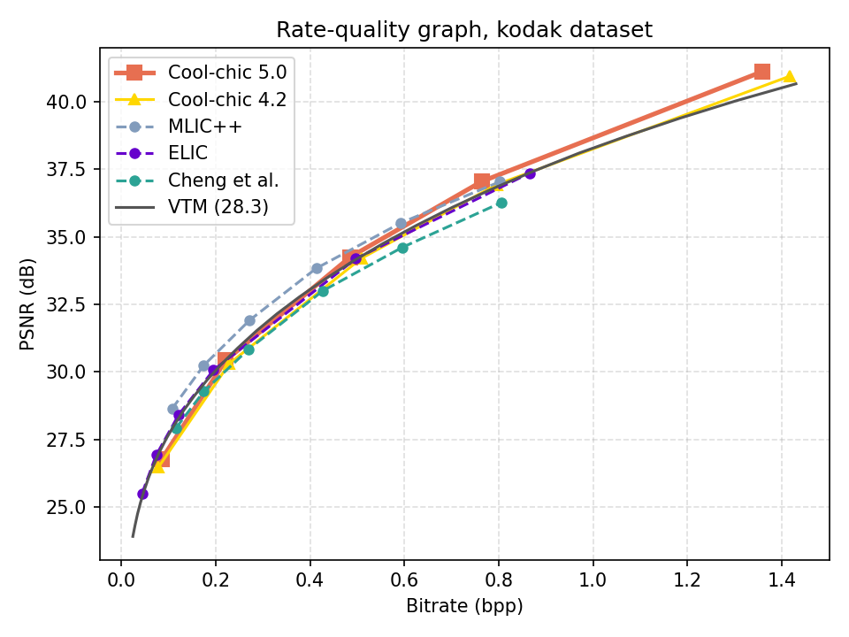

Image coding performance
========================

We provide comprehensive experimental results demonstrating the compression
performance of Cool-chic, its low decoding complexity and the associated
encoding complexity.

We also provide some already encoded bitstreams in ``samples/bitstream/`` so
that everybody can decode them to try out our fast CPU-only neural decoder.

.. raw:: html

    
    

.. role:: red

.. role:: green

Image compression performance are presented on the `kodak
<https://www.kaggle.com/datasets/sherylmehta/kodak-dataset>`_ (RGB),
`clic20-pro-valid
<https://data.vision.ee.ethz.ch/cvl/clic/professional_valid_2020.zip>`_ (RGB)
and jvet (YUV420) datasets. The overall MSE is obtained by averaging the 3
channels weighted by their respective resolution. More information about
obtaining one single MSE for the entire dataset is discussed in this `github
issue
<https://github.com/Orange-OpenSource/Cool-Chic/issues/13#issuecomment-2548447594>`_.

BD-rate
*******

The following table sums up the compression performance obtained by Cool-chic
5.0 against different anchors. Results are measure through `BD-rates
<https://github.com/Anserw/Bjontegaard_metric>`_ which represents the relative
rate required for Cool-chic to obtain the same quality as some other codec.
Cool-chic 5.0 decoding complexity is set to **2 000 MAC / pixel** for all datasets (HOP configuration).

.. raw:: html

  
  <table class="tg"><thead>
    <tr>
      <th class="tg-86ol" rowspan="2"></th>
      <th class="tg-86ol" colspan="6">BD-rate of Cool-chic 5.0.1 vs. [%]</th>
    </tr>
    <tr>
      <th class="tg-86ol"><a href="https://arxiv.org/abs/2001.01568" target="_blank" rel="noopener noreferrer">Cheng</a></th>
      <th class="tg-86ol"><a href="https://arxiv.org/abs/2203.10886" target="_blank" rel="noopener noreferrer">ELIC</a></th>
      <th class="tg-86ol"><a href="https://arxiv.org/abs/2307.15421" target="_blank" rel="noopener noreferrer">MLIC++</a></th>
      <th class="tg-86ol">Cool-chic 4.2 </th>
      <th class="tg-86ol">Cool-chic 5.0.0 </th>
      <th class="tg-86ol">VVC (VTM 28.3)</th>
    </tr></thead>
  <tbody>
    <tr>
      <td class="tg-86ol">kodak (RGB)</td>
      <td class="tg-qch7">-10.4 %</td>
      <td class="tg-xd3r">+0.1 %</td>
      <td class="tg-xd3r">+10.2%</td>
      <td class="tg-qch7">-6.1 %</td>
      <td class="tg-qch7">-1.2 %</td>
      <td class="tg-qch7">-3.9 % </td>
    </tr>
    <tr>
      <td class="tg-86ol">clic20-pro-valid (RGB)</td>
      <td class="tg-qch7">-21.3 %</td>
      <td class="tg-qch7">-9.5 %</td>
      <td class="tg-xd3r">+0.5 %</td>
      <td class="tg-qch7">-9.9 %</td>
      <td class="tg-qch7">-0.6 %</td>
      <td class="tg-qch7">-11.6%</td>
    </tr>
    <tr>
      <td class="tg-x9uu">jvet A (YUV420)</td>
      <td class="tg-1keu">/</td>
      <td class="tg-1keu">/</td>
      <td class="tg-1keu">/</td>
      <td class="tg-1keu">/</td>
      <td class="tg-qch7">-1.4 %</td>
      <td class="tg-qch7">-4.0 %</td>
    </tr>
    <tr>
      <td class="tg-x9uu">jvet B (YUV420) </td>
      <td class="tg-1keu">/</td>
      <td class="tg-1keu">/</td>
      <td class="tg-1keu">/</td>
      <td class="tg-qch7">-13.7%</td>
      <td class="tg-qch7">-1.9 %</td>
      <td class="tg-xd3r">+6.6 %</td>
    </tr>
  </tbody></table>

Rate-distortion graphs
**********************

CLIC20 Pro Valid
****************

Kodak
*****

