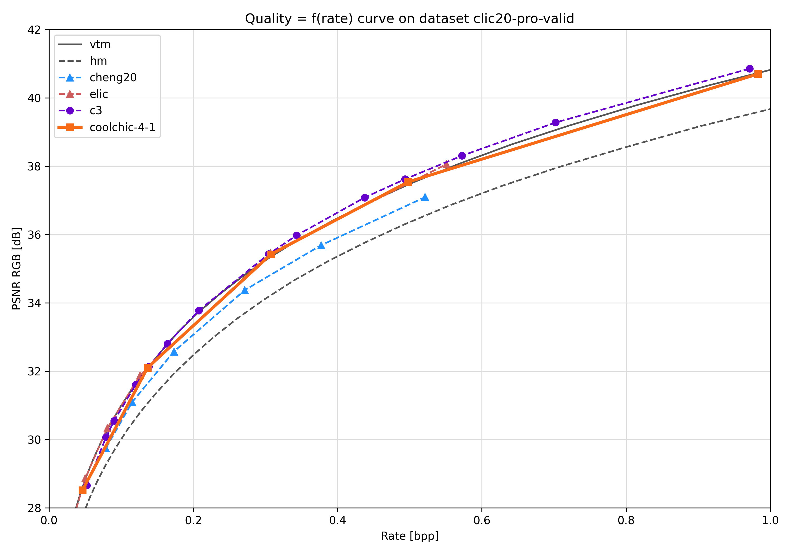
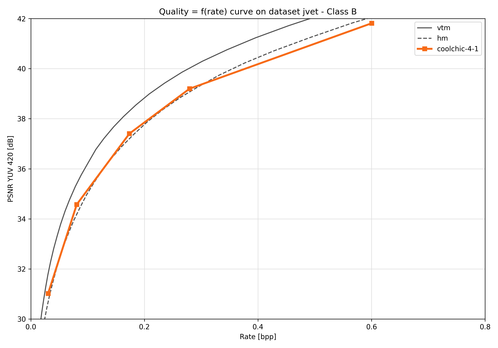
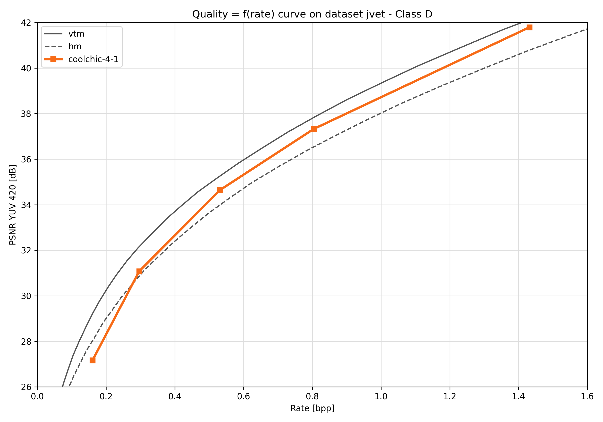
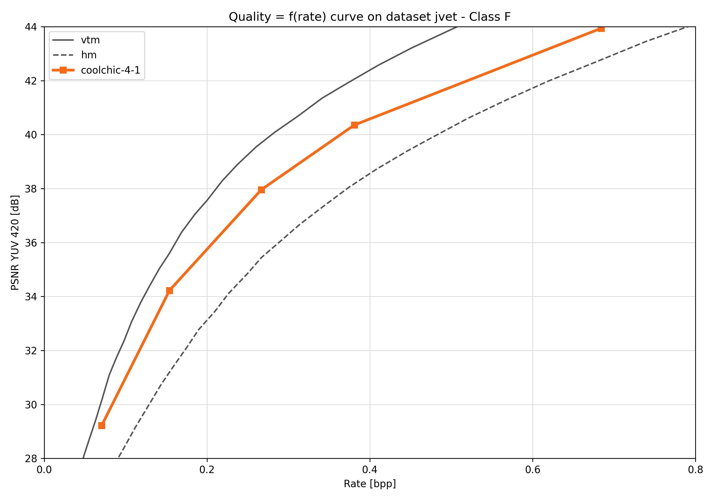
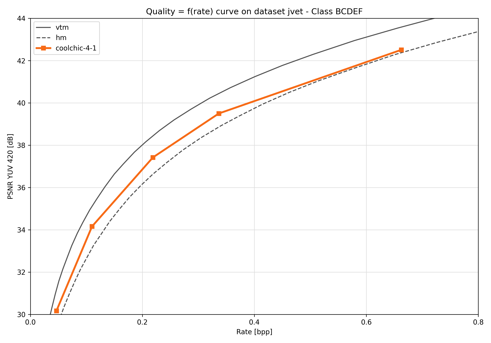

:layout: simple

Compression performance
=======================

.. raw:: html

    
    

.. role:: red

.. role:: green

Image compression performance are presented on the `kodak
<https://www.kaggle.com/datasets/sherylmehta/kodak-dataset>`_ (RGB),
`clic20-pro-valid
<https://data.vision.ee.ethz.ch/cvl/clic/professional_valid_2020.zip>`_ (RGB)
and jvet (YUV420) datasets. The overall MSE is obtained by averaging the 3
channels weighted by their respective resolution. More information about
obtaining one single MSE for the entire dataset is discussed in this `github
issue
<https://github.com/Orange-OpenSource/Cool-Chic/issues/13#issuecomment-2548447594>`_.

BD-rate
*******

The following table sums up the compression performance obtained by Cool-chic
3.4 against different anchors. Results are measure through `BD-rates
<https://github.com/Anserw/Bjontegaard_metric>`_ which represents the relative
rate required for Cool-chic to obtain the same quality than some other codec.

.. raw:: html

  
  <table class="tg"><thead>
    <tr>
      <th class="tg-86ol" rowspan="2"></th>
      <th class="tg-86ol" colspan="6">BD-rate of Cool-chic 3.4 vs. [%]</th>
      <th class="tg-86ol" colspan="2">Avg. decoder complexity</th>
    </tr>
    <tr>
      <th class="tg-86ol"><a href="https://arxiv.org/abs/2001.01568" target="_blank" rel="noopener noreferrer">Cheng</a></th>
      <th class="tg-86ol"><a href="https://arxiv.org/abs/2203.10886" target="_blank" rel="noopener noreferrer">ELIC</a></th>
      <th class="tg-dfl2">Cool-chic 3.3</th>
      <th class="tg-86ol"><a href="https://arxiv.org/abs/2312.02753" target="_blank" rel="noopener noreferrer">C3</a></th>
      <th class="tg-86ol">HEVC (HM 16)</th>
      <th class="tg-86ol">VVC (VTM 19)</th>
      <th class="tg-86ol">MAC / pixel</th>
      <th class="tg-86ol">CPU Time [ms]</th>
    </tr></thead>
  <tbody>
    <tr>
      <td class="tg-86ol">kodak</td>
      <td class="tg-qch7">-4.2 %</td>
      <td class="tg-xd3r">+7.5 %</td>
      <td class="tg-qch7">-0.9 %</td>
      <td class="tg-qch7">-4.3 %</td>
      <td class="tg-qch7">-17.2 %</td>
      <td class="tg-xd3r">+3.4 % </td>
      <td class="tg-dfl2">1303</td>
      <td class="tg-dfl2">74</td>
    </tr>
    <tr>
      <td class="tg-86ol">clic20-pro-valid</td>
      <td class="tg-qch7">-13.2 %</td>
      <td class="tg-qch7">-0.2 %</td>
      <td class="tg-qch7">-0.3 %</td>
      <td class="tg-qch7">-1.3 %</td>
      <td class="tg-qch7">-25.1 %</td>
      <td class="tg-qch7">-2.3 % </td>
      <td class="tg-dfl2">1357</td>
      <td class="tg-dfl2">354</td>
    </tr>
    <tr>
      <td class="tg-86ol">jvet (BCDEF)</td>
      <td class="tg-5niz">/</td>
      <td class="tg-5niz">/</td>
      <td class="tg-qch7">-0.2 %</td>
      <td class="tg-5niz">/</td>
      <td class="tg-qch7">-18.3 %</td>
      <td class="tg-xd3r">+18.6 %</td>
      <td class="tg-dfl2">1249</td>
      <td class="tg-dfl2">143</td>
    </tr>
    <tr>
      <td class="tg-x9uu">jvet (class B)</td>
      <td class="tg-1keu">/</td>
      <td class="tg-1keu">/</td>
      <td class="tg-arzi">+0.9%</td>
      <td class="tg-1keu">/</td>
      <td class="tg-uflc">-9.9 %</td>
      <td class="tg-arzi">+20.7 %</td>
      <td class="tg-m5nv">1300</td>
      <td class="tg-m5nv">282</td>
    </tr>
    <tr>
      <td class="tg-x9uu">jvet (class C)</td>
      <td class="tg-1keu">/</td>
      <td class="tg-1keu">/</td>
      <td class="tg-uflc">-1.3%</td>
      <td class="tg-1keu">/</td>
      <td class="tg-uflc">-16.1 %</td>
      <td class="tg-arzi">+9.2 %</td>
      <td class="tg-m5nv">1289</td>
      <td class="tg-m5nv">69</td>
    </tr>
    <tr>
      <td class="tg-x9uu">jvet (class D)</td>
      <td class="tg-1keu">/</td>
      <td class="tg-1keu">/</td>
      <td class="tg-uflc">-1.4%</td>
      <td class="tg-1keu">/</td>
      <td class="tg-uflc">-12.4 %</td>
      <td class="tg-arzi">+9.6 %</td>
      <td class="tg-m5nv">948</td>
      <td class="tg-m5nv">18</td>
    </tr>
    <tr>
      <td class="tg-x9uu">jvet (class E)</td>
      <td class="tg-1keu">/</td>
      <td class="tg-1keu">/</td>
      <td class="tg-uflc">-3.8%</td>
      <td class="tg-1keu">/</td>
      <td class="tg-uflc">-6.2 %</td>
      <td class="tg-arzi">+27.8 %</td>
      <td class="tg-m5nv">1347</td>
      <td class="tg-m5nv">125</td>
    </tr>
    <tr>
      <td class="tg-x9uu">jvet (class F)</td>
      <td class="tg-1keu">/</td>
      <td class="tg-1keu">/</td>
      <td class="tg-arzi">+0.2%</td>
      <td class="tg-1keu">/</td>
      <td class="tg-uflc">-31.8 %</td>
      <td class="tg-arzi">+20.6 %</td>
      <td class="tg-m5nv">1249</td>
      <td class="tg-m5nv">182</td>
    </tr>
  </tbody></table>

Decoding time are obtained on a single CPU core of an an **AMD EPYC 7282 16-Core
Processor**, PSNR is computed in the **RGB** domain for kodak and CLIC20, in the
**YUV420** domain for jvet. More details about decoding time are available in
:doc:`the decoding complexity results <./decoding_complexity>`.

Rate-distortion graphs
**********************

Kodak
*****

.. image:: ../../assets/kodak/rd.png
  :alt: Kodak rd results

CLIC20 Pro Valid
****************

JVET Class B
************

JVET Class C
************

JVET Class D
************

JVET Class E
************

JVET Class F
************

JVET All Classes
****************

