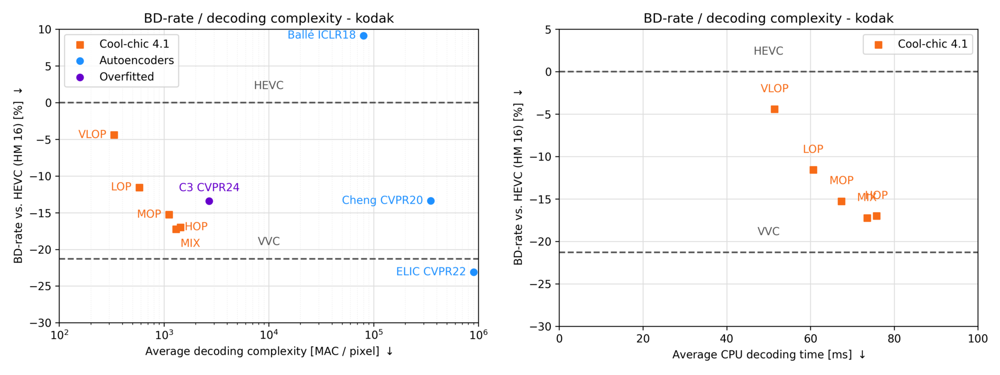
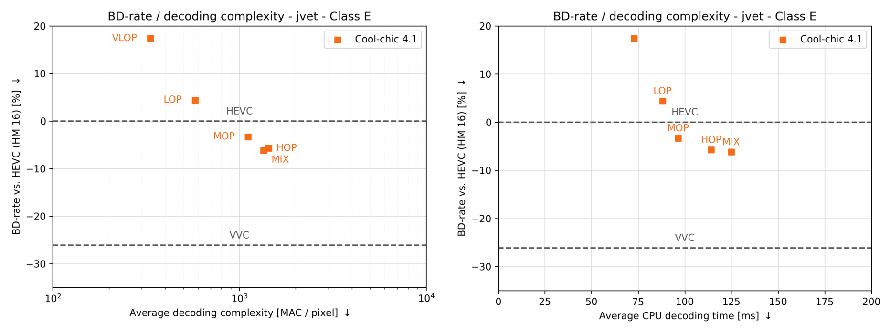
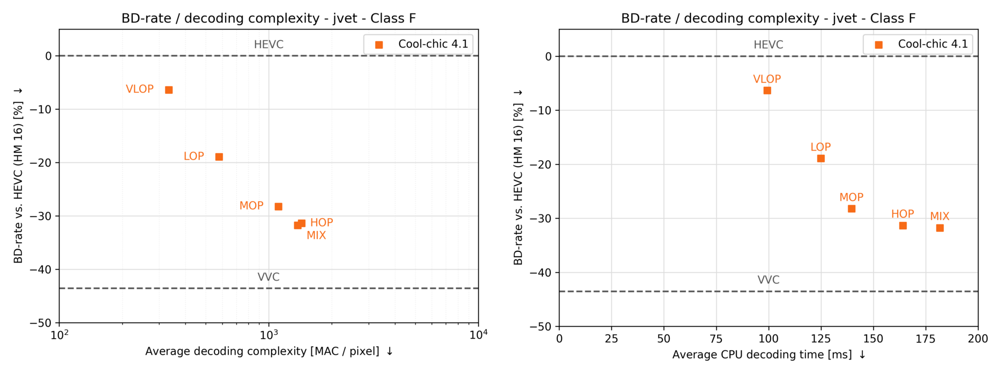

:layout: simple

Decoding complexity
===================

As described in the :doc:`decoder configuration <../../encoding/architecture>`
section, Cool-chic decoder can be made as simple (or complex) as desired. We
present here the performance-complexity continuum obtained through the :ref:`4
provided configurations <decoder_cfg_files>` (*VLOP*, *LOP*, *MOP*, *HOP*). We
also add a *MIX* configuration, where we pick the best configuration out of the
4 available ones for each image. We used the ``slow_100k`` :ref:`encoding preset
<encoder_cfg_files>`.

Decoding complexity is measured both in multiplication per decoded pixel and
decoding time, obtained on a single core of an **AMD EPYC 7282 16-Core
Processor**.

Kodak
*****

CLIC20 Pro Valid
****************

.. image:: ../../assets/clic20-pro-valid/all_complexity_dec.png
  :alt: CLIC20 rd results

JVET Class B
************

JVET Class C
************

JVET Class D
************

JVET Class E
************

JVET Class F
************

JVET All Classes
****************

