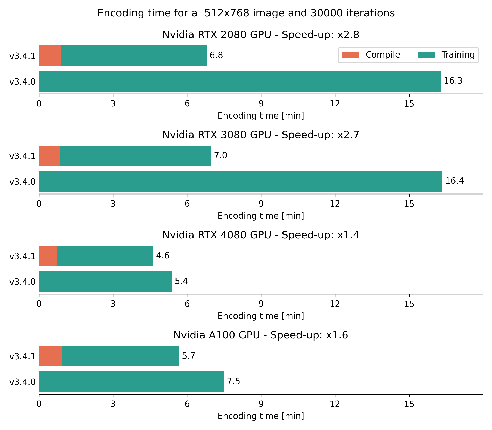
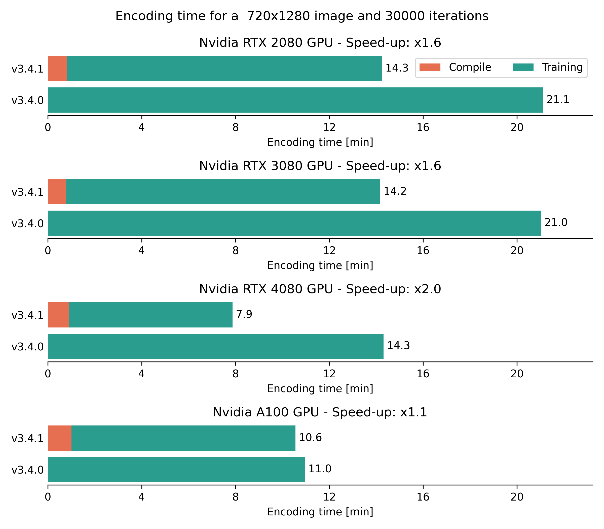

Encoding complexity
===================

Number of iterations
""""""""""""""""""""

As for conventional codecs (e.g. HEVC or VVC), Cool-chic encoding time is
variable. A longer encoding gives better compression performance while a reduced
encoding time results in slightly degraded coding efficiency.

We present here the impact of the number of encoding iterations on the
compression performance by comparing the results obtained through the :ref:`3 proposed
configurations <encoder_cfg_files>` in ``cfg/enc/``: ``fast_10k``, ``medium_30k`` and ``slow_100k``.
We used the ``hop`` :ref:`decoding preset <decoder_cfg_files>`.

Kodak
*****

CLIC20 Pro Valid
****************

JVET Class B
************

JVET Class C
************

JVET Class D
************

JVET Class E
************

JVET Class F
************

JVET All Classes
****************

.. _encoding_timing:
Encoding time
"""""""""""""

The actual time required to perform one encoding iteration depends on the
hardware, the image resolution and... the Cool-chic version since more recent versions
are usually more optimized.

.. important::
    Starting from Cool-chic 3.4.1, ``torch.compile`` is used to significantly reduce the encoding time

Here are a comparison of the encoding time required for 3 different resolutions
on different hardwares and Cool-chic versions. This is obtained with the
``medium_30k`` encoding configuration.

512x768 image
*************

720x1280 image
**************

1363x2048 image
***************

.. image:: ../../assets/encoding-time/encoding-time-clic.png
  :alt: Encoding time on CLIC
