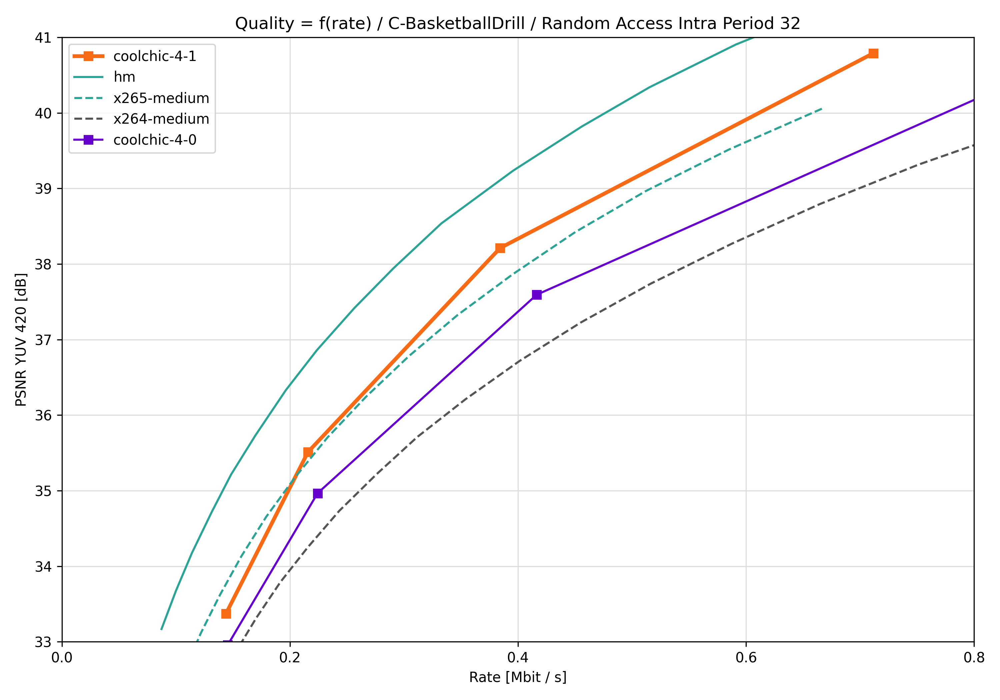
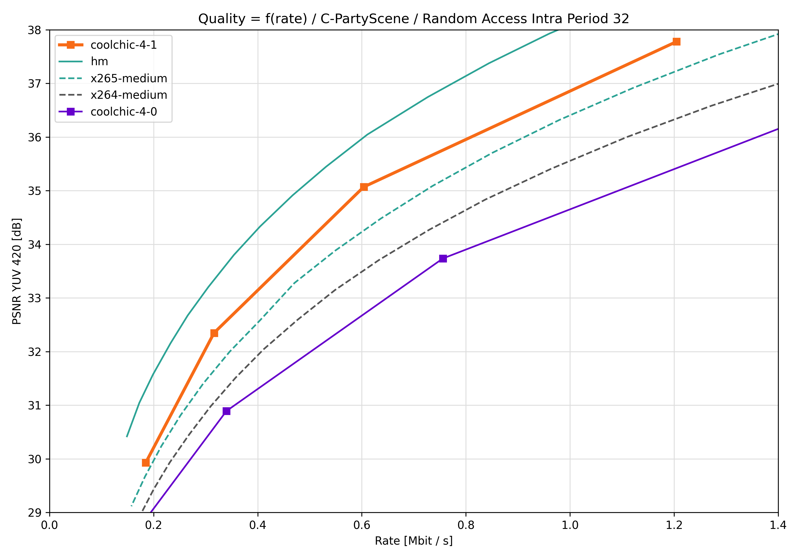
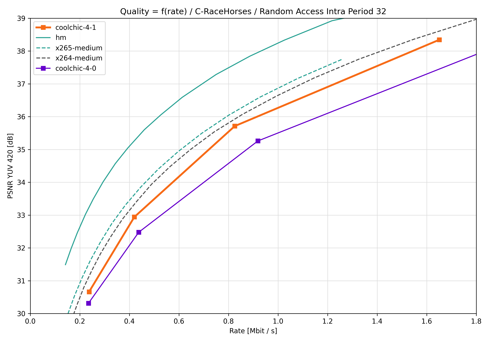

:layout: simple

Video results
=============

.. raw:: html

    
    

.. role:: red

.. role:: green

Video compression performance are presented on the entire JVET test sequences.
PSNR in the YUV420 domain are obtained as follows:

.. math::

    \mathrm{PSNR_{YUV420}} = -10 \log_{10} \left(\frac{\mathrm{MSE}_Y + \mathrm{MSE}_U + \mathrm{MSE}_V}{6}\right).

Random-access compression
*************************

The following table sums up the compression performance obtained by Cool-chic
4.0 against HEVC in a random access configuration settings. An intra period of
32 frames is used. Results are measure through `BD-rates
<https://github.com/Anserw/Bjontegaard_metric>`_ which represents the relative
rate required for Cool-chic to obtain the same quality than some other codec.

.. raw:: html

    
    <table class="tg"><thead>
    <tr>
        <th class="tg-86ol" rowspan="2">Sequence</th>
        <th class="tg-86ol" colspan="3">BD-rate of Cool-chic 4.0.0 against [%]</th>
        <th class="tg-86ol" colspan="2">Decoding complexity</th>
    </tr>
    <tr>
        <th class="tg-86ol">HEVC (HM 16)</th>
        <th class="tg-86ol">HEVC (x265-medium)</th>
        <th class="tg-86ol">AVC (x264-medium)</th>
        <th class="tg-86ol">MAC / pixel</th>
        <th class="tg-86ol">Frame rate [fps]</th>
    </tr></thead>
    <tbody>
    <tr>
        <td class="tg-9mze">C-BasketballDrill</td>
        <td class="tg-xd3r">+59.6</td>
        <td class="tg-xd3r">+15.2</td>
        <td class="tg-qch7">-11.5</td>
        <td class="tg-dfl2">946</td>
        <td class="tg-dfl2">18.3</td>
    </tr>
    <tr>
        <td class="tg-9mze">C-BQMall</td>
        <td class="tg-xd3r">+128.7</td>
        <td class="tg-xd3r">+49.3</td>
        <td class="tg-xd3r">+20.6</td>
        <td class="tg-dfl2">945</td>
        <td class="tg-dfl2">16.7</td>
    </tr>
    <tr>
        <td class="tg-9mze">C-PartyScene</td>
        <td class="tg-xd3r">+113.0</td>
        <td class="tg-xd3r">+37.9</td>
        <td class="tg-xd3r">+20.3</td>
        <td class="tg-dfl2">946</td>
        <td class="tg-dfl2">17.5</td>
    </tr>
    <tr>
        <td class="tg-9mze">C-RaceHorses</td>
        <td class="tg-xd3r">+118.7</td>
        <td class="tg-xd3r">+41.0</td>
        <td class="tg-xd3r">+19.3</td>
        <td class="tg-dfl2">950</td>
        <td class="tg-dfl2">16.5</td>
    </tr>
    <tr>
        <td class="tg-u3ui">Average</td>
        <td class="tg-aaaa">+105.0</td>
        <td class="tg-aaaa">+35.9</td>
        <td class="tg-aaaa">+12.2</td>
        <td class="tg-u3ui">947</td>
        <td class="tg-u3ui">17.3</td>
    </tr>
    </tbody></table>

Decoding time are obtained on a single CPU core of an **Intel Core i9-9940X
CPU @ 3.30GHz Processor**.

Rate-distortion graphs
**********************

C-BasketballDrill
*****************

C-BQMall
********

C-PartyScene
************

C-RaceHorses
************

